# Transcriptomic-analysis-identifies-lactoferrin-induced-quiescent-circuits-in-neonatal-macrophages
Data repository and Code repository for the publication "Transcriptomic analysis identifies lactoferrin-induced quiescent circuits in neonatal macrophages"
Markdown_Analyses_Lactoferrin
================
Michael Eigenschink MD
2023-09-13

MaEndToEnd Workflow
[link](https://bioconductor.riken.jp/packages/3.9/workflows/vignettes/maEndToEnd/inst/doc/MA-Workflow.html)  
RegEnrich
[link](https://bioconductor.org/packages/release/bioc/vignettes/RegEnrich/inst/doc/RegEnrich.html)  
GoPlot [link](https://wencke.github.io/)  
ComplexHeatmap
[link](https://jokergoo.github.io/ComplexHeatmap-reference/book/)  
The Human Protein Atlas [link](https://www.proteinatlas.org/)  
InnateDB [link](https://www.innatedb.com/)  
ImmPort Cytokine Registry
[link](https://www.immport.org/resources/cytokineRegistry)  
Reactome [link](https://reactome.org/)  
KeGG Pathway Database [link](https://www.genome.jp/kegg/pathway.html)  
Compare Cluster
[link](https://yulab-smu.top/biomedical-knowledge-mining-book/clusterprofiler-comparecluster.html)  
StringDB [link](https://string-db.org/)

# Import of data + initial wrangling

``` r
setwd("C:/Users/Michi/Documents/Microarray Analysis/data")
SDRF = import("phenodata.csv")
rownames(SDRF) <- SDRF$File 
SDRF <- AnnotatedDataFrame(SDRF)

rawdata_dir = getwd()
raw_data <- oligo::read.celfiles(filenames = file.path(rawdata_dir, 
                                                       SDRF$File),
                                 verbose = FALSE, phenoData = SDRF)
stopifnot(validObject(raw_data))
Biobase::pData(raw_data)

raw_data$condition <- as.factor(raw_data$condition)
raw_data$sample_id <- as.factor(raw_data$sample_id)
raw_data$proband <- as.factor(raw_data$proband)
```

## Dependencies

``` r
library(pacman)

pacman::p_load(ggplot2)
pacman::p_load(maEndToEnd)
pacman::p_load(hugene21stprobeset.db)
pacman::p_load(hugene21sttranscriptcluster.db)
pacman::p_load(ggfortify)
pacman::p_load(rio)
pacman::p_load(plotly)
pacman::p_load(viridis)
pacman::p_load(RcolorBrewer)
pacman::p_load(pheatmap)
pacman::p_load(palatteer)
pacman::p_load(clusterProfiler)
pacman::p_load(enrichplot)
pacman::p_load(pathview)
pacman::p_load(tidyverse)
pacman::p_load(rio)
pacman::p_load(STRINGdb)
pacman::p_load(export)
pacman::p_load(fmsb)
pacman::p_load(tidyr)
pacman::p_load(Biobase)
pacman::p_load(cancerTiming)
pacman::p_load(ReactomePA)
pacman::p_load(limma)
pacman::p_load(maEndToEnd)
pacman::p_load(RColorBrewer)
pacman::p_load(enrichplot)
pacman::p_load(devtools)
pacman::p_load(remotes)
pacman::p_load(ComplexHeatmap)
pacman::p_load(RColorBrewer)
pacman::p_load(circlize)
pacman::p_load(factoextra)
pacman::p_load(FactoMineR)
pacman::p_load(VennDiagram)
pacman::p_load(gcookbook)
pacman::p_load(GOplot)
pacman::p_load(viridis)
pacman::p_load(RColorBrewer)
pacman::p_load(DOSE)
pacman::p_load(enrichplot)
pacman::p_load(RegEnrich)
pacman::p_load(networkD3)
pacman::p_load(htmlwidgets)
pacman::p_load(Tmisc)
pacman::p_load(scales)

install_github("jokergoo/ComplexHeatmap", force = TRUE)


set.seed(123)
```

# Data preparation

## Quality control of data

``` r
#log2-transformation
exp_raw <- log2(Biobase::exprs(raw_data))

#Preparation for PCA of log2-transformed raw-data
PCA_raw <- prcomp(t(exp_raw), scale. = FALSE)
percentVar <- round(100*PCA_raw$sdev^2/sum(PCA_raw$sdev^2),1)
sd_ratio <- sqrt(percentVar[2] / percentVar[1])

dataGG <- data.frame(PC1 = PCA_raw$x[,1], PC2 = PCA_raw$x[,2],
                     Condition = pData(raw_data)$condition,
                     Individual = pData(raw_data)$proband)
h <- ggplot(dataGG, aes(PC1, PC2)) +
  geom_point(aes(colour = Condition, shape = Individual), size = 2.5) +
  ggtitle("PCA plot of the log-transformed raw expression data") +
  xlab(paste0("PC1, VarExp: ", percentVar[1], "%")) +
  ylab(paste0("PC2, VarExp: ", percentVar[2], "%")) +
  theme(plot.title = element_text(hjust = 0.5))+
  coord_fixed(ratio = sd_ratio) +  scale_fill_brewer("Dark2") +
  scale_shape_manual(values = c(19,15,17,18)) + theme_light()

plot(h)
```

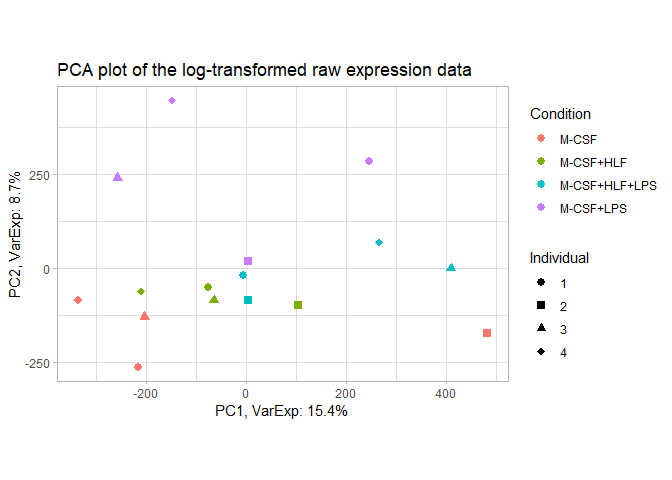<!-- -->

``` r
#Probe intensities for log2-transformed raw-data
oligo::boxplot(raw_data, target = "core", 
               main = "Boxplot of log2-intensitites for the raw data")
```

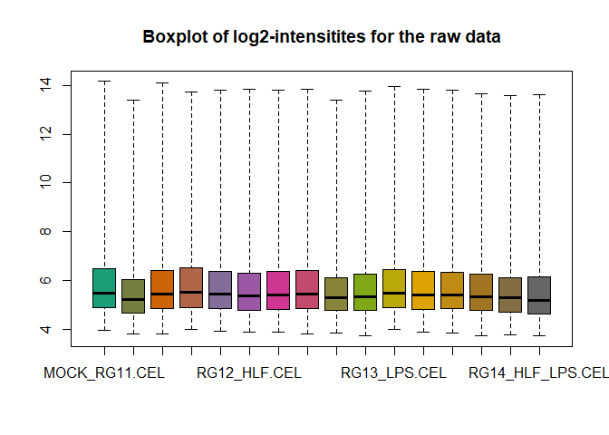<!-- -->

### Relative Log Expression data quality analysis

``` r
#RMA without normalization
palmieri_eset <- oligo::rma(raw_data, target = "core", normalize = FALSE)
```

    ## Background correcting
    ## Calculating Expression

``` r
#RLE + visualisation
row_medians_assayData <- 
  Biobase::rowMedians(as.matrix(Biobase::exprs(palmieri_eset)))

RLE_data <- sweep(Biobase::exprs(palmieri_eset), 1, row_medians_assayData)

RLE_data <- as.data.frame(RLE_data)
RLE_data_gathered <- 
  tidyr::gather(RLE_data, patient_array, log2_expression_deviation)

ggplot2::ggplot(RLE_data_gathered, aes(patient_array,
                                       log2_expression_deviation)) + 
  geom_boxplot(outlier.shape = NA) + 
  ylim(c(-2, 2)) + 
  theme(axis.text.x = element_text(colour = "aquamarine4", 
                                   angle = 60, size = 6.5, hjust = 1 ,
                                   face = "bold"))
```

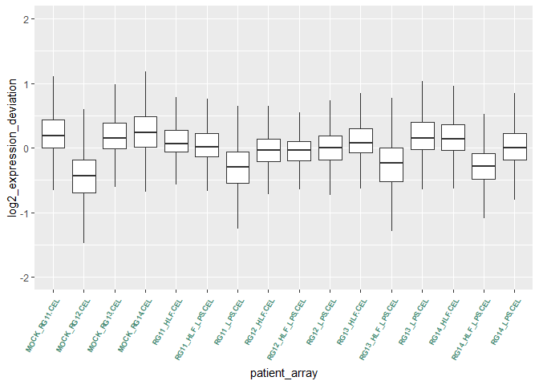<!-- -->

### Background correction (Deconvolution), normalization (quantile normalization) and summarization (robust multichip average = RMA)

``` r
palmieri_eset_norm <- oligo::rma(raw_data, target = "core")
```

    ## Background correcting
    ## Normalizing
    ## Calculating Expression

## Quality assessement of calibrated data

``` r
#PCA
exp_palmieri <- Biobase::exprs(palmieri_eset_norm)
PCA <- prcomp(t(exp_palmieri), scale = FALSE)

percentVar <- round(100*PCA$sdev^2/sum(PCA$sdev^2),1)
sd_ratio <- sqrt(percentVar[2] / percentVar[1])

dataGG <- data.frame(PC1 = PCA$x[,1], PC2 = PCA$x[,2],
                     Condition = 
                       Biobase::pData(palmieri_eset_norm)$condition,
                     Individual = 
                       Biobase::pData(palmieri_eset_norm)$proband)


ggplot(dataGG, aes(PC1, PC2)) +
  geom_point(aes(shape = Individual, colour = Condition), size = 2.5) +
  ggtitle("PCA plot of the calibrated, summarized data") +
  xlab(paste0("PC1, VarExp: ", percentVar[1], "%")) +
  ylab(paste0("PC2, VarExp: ", percentVar[2], "%")) +
  theme(plot.title = element_text(hjust = 0.5)) +
  coord_fixed(ratio = sd_ratio) +  scale_fill_brewer("Dark2") +
  scale_shape_manual(values = c(19,15,17,18)) + theme_light()
```

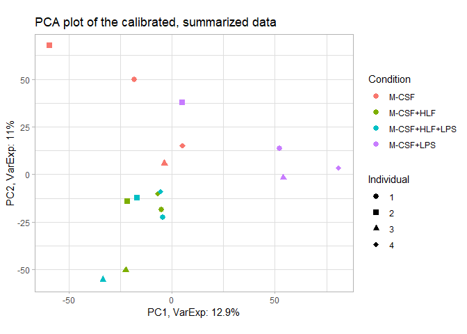<!-- -->

``` r
#Heatmap 
annotation_for_heatmap <- 
  data.frame(Proband = palmieri_eset_norm$proband,  Condition = palmieri_eset_norm$condition)

row.names(annotation_for_heatmap) <- row.names(pData(palmieri_eset_norm))

dists <- as.matrix(dist(t(exp_palmieri), method = "manhattan"))

rownames(dists) <- row.names(pData(palmieri_eset_norm))
hmcol <- rev(colorRampPalette(RColorBrewer::brewer.pal(9, "YlOrRd"))(255))
colnames(dists) <- NULL
diag(dists) <- NA

ann_colors <- list(
  Proband = c("1" = "chartreuse4", "2" = "burlywood3", "3" = "lightblue4", "4" = "blue"),
  Condition = c("M-CSF" = "ivory4", "M-CSF+HLF" = "lightpink4", "M-CSF+LPS" = "indianred4", "M-CSF+HLF+LPS" = "lightskyblue4")
)

pheatmap(dists, col = (hmcol), 
         annotation_row = annotation_for_heatmap,
         annotation_colors = ann_colors,
         legend = TRUE, 
         treeheight_row = 0,
         legend_breaks = c(min(dists, na.rm = TRUE), 
                           max(dists, na.rm = TRUE)), 
         legend_labels = (c("small distance", "large distance")),
         main = "Clustering heatmap for the calibrated samples")
```

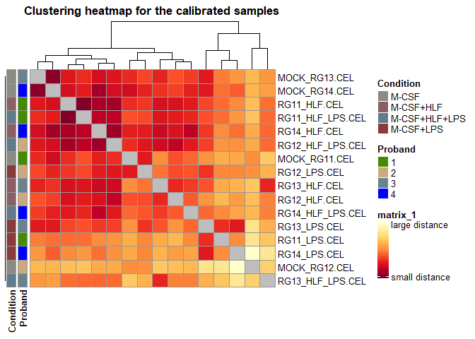<!-- -->

## Intensity based filtering

``` r
#calculate medians + plot them in histogram
palmieri_medians <- rowMedians(Biobase::exprs(palmieri_eset_norm))

hist_res <- hist(palmieri_medians, 100, col = "cornsilk1", freq = FALSE, 
                 main = "Histogram of the median intensities", 
                 border = "antiquewhite4",
                 xlab = "Median intensities")
```

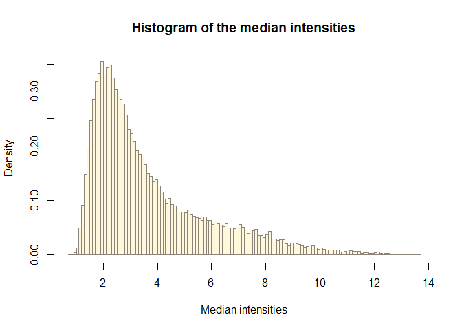<!-- -->

``` r
#select cutoff
man_threshold <- 2

#plot cutoff
hist_res <- hist(palmieri_medians, 100, col = "cornsilk", freq = FALSE, 
                 main = "Histogram of the median intensities",
                 border = "antiquewhite4",
                 xlab = "Median intensities")

abline(v = man_threshold, col = "coral4", lwd = 2)
```

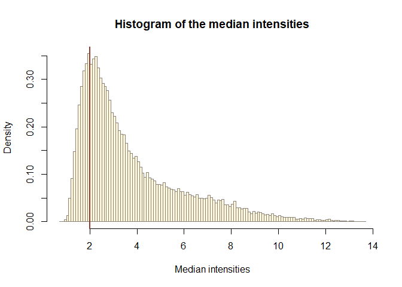<!-- -->

``` r
#identify transcripts that need to be excluded
no_of_samples <- 
  table(paste0(pData(palmieri_eset_norm)$condition))
no_of_samples 
```

    ## 
    ##         M-CSF     M-CSF+HLF M-CSF+HLF+LPS     M-CSF+LPS 
    ##             4             4             4             4

``` r
samples_cutoff <- min(no_of_samples)

idx_man_threshold <- apply(Biobase::exprs(palmieri_eset_norm), 1,
                           function(x){
                             sum(x > man_threshold) >= samples_cutoff})
table(idx_man_threshold)
```

    ## idx_man_threshold
    ## FALSE  TRUE 
    ##  6397 47220

``` r
#subset data = intensity based filtered data
palmieri_manfiltered <- subset(palmieri_eset_norm, idx_man_threshold)
```

## Transcript annotation

``` r
#add annotation information
anno_palmieri <- AnnotationDbi::select(hugene21sttranscriptcluster.db,
                                       keys = (featureNames(palmieri_manfiltered)),
                                       columns = c("SYMBOL", "GENENAME", "ENTREZID"),
                                       keytype = "PROBEID")
```

    ## 'select()' returned 1:many mapping between keys and columns

``` r
anno_palmieri <- subset(anno_palmieri, !is.na(SYMBOL))

#filtering out and removing multiple mappings + creating dataset to work with
anno_grouped <- group_by(anno_palmieri, PROBEID)
anno_summarized <- 
  dplyr::summarize(anno_grouped, no_of_matches = n_distinct(SYMBOL))


anno_filtered <- filter(anno_summarized, no_of_matches > 1)
probe_stats <- anno_filtered 
nrow(probe_stats)
```

    ## [1] 1996

``` r
ids_to_exlude <- (featureNames(palmieri_manfiltered) %in% probe_stats$PROBEID)
table(ids_to_exlude)
```

    ## ids_to_exlude
    ## FALSE  TRUE 
    ## 45224  1996

``` r
palmieri_final <- subset(palmieri_manfiltered, !ids_to_exlude)
validObject(palmieri_final)
```

    ## [1] TRUE

``` r
fData(palmieri_final)$PROBEID <- rownames(fData(palmieri_final))
fData(palmieri_final) <- left_join(fData(palmieri_final), anno_palmieri)
```

    ## Joining, by = "PROBEID"

``` r
rownames(fData(palmieri_final)) <- fData(palmieri_final)$PROBEID
palmieri_final = subset(palmieri_final, !is.na(fData(palmieri_final)$SYMBOL))


validObject(palmieri_final)
```

    ## [1] TRUE

# Analysis of data structure

## Setting up the linear model

``` r
#wrangling
proband <-as.character(Biobase::pData(palmieri_final)$proband)
stimulation <- (Biobase::pData(palmieri_final)$condition)

#design matrix
design_macrophage_model <- model.matrix(~ 0 + stimulation + proband)
colnames(design_macrophage_model)[1:4] <- c("MCSF", "MCSF_HLF", "MCSF_HLF_LPS", "MCSF_LPS")
rownames(design_macrophage_model) <- proband

head(design_macrophage_model)
```

    ##   MCSF MCSF_HLF MCSF_HLF_LPS MCSF_LPS proband2 proband3 proband4
    ## 1    1        0            0        0        0        0        0
    ## 2    1        0            0        0        1        0        0
    ## 3    1        0            0        0        0        1        0
    ## 4    1        0            0        0        0        0        1
    ## 1    0        1            0        0        0        0        0
    ## 2    0        1            0        0        1        0        0

``` r
#contrast matrix
contrast_matrix <- makeContrasts(comparison1 = MCSF_LPS - MCSF, 
                                 comparison2 = MCSF_HLF - MCSF, 
                                 comparison3 = MCSF_HLF_LPS - MCSF_LPS, 
                                 comparison4 = MCSF_HLF_LPS - MCSF_HLF, levels = design_macrophage_model)

#fit linear model applying the empirical Bayes variance moderation 
macrophage_fit <- eBayes(contrasts.fit(lmFit(palmieri_final, design = design_macrophage_model), contrast_matrix))

table_fit <- topTable(macrophage_fit, number= Inf)
head(table_fit)
```

    ##           PROBEID   SYMBOL                             GENENAME ENTREZID
    ## 16692846 16692846     CTSK                          cathepsin K     1513
    ## 16693414 16693414   S100A8      S100 calcium binding protein A8     6279
    ## 16819257 16819257     MT1H                   metallothionein 1H     4496
    ## 16757347 16757347     OAS3    2'-5'-oligoadenylate synthetase 3     4940
    ## 17070492 17070492 ATP6V0D2 ATPase H+ transporting V0 subunit d2   245972
    ## 16826738 16826738     MT1G                   metallothionein 1G     4495
    ##          comparison1 comparison2 comparison3 comparison4  AveExpr        F
    ## 16692846  -0.1253842   5.5594722   5.5547105 -0.13014583 8.088217 648.2115
    ## 16693414   4.5134550   3.7675327  -0.7713966 -0.02547440 8.317271 151.9902
    ## 16819257   6.8741630   1.2767552  -5.5464117  0.05099613 5.921499 149.9082
    ## 16757347   2.8861117  -0.3172088  -3.0744281  0.12889242 6.670402 147.1852
    ## 17070492  -2.5525379   1.3122423   3.7465824 -0.11819783 6.543791 146.0254
    ## 16826738   6.3613898   0.8145573  -4.8178741  0.72895831 6.099512 145.2026
    ##               P.Value    adj.P.Val
    ## 16692846 3.329002e-15 8.900752e-11
    ## 16693414 6.919321e-11 4.196607e-07
    ## 16819257 7.594528e-11 4.196607e-07
    ## 16757347 8.594458e-11 4.196607e-07
    ## 17070492 9.065484e-11 4.196607e-07
    ## 16826738 9.417528e-11 4.196607e-07

``` r
#make histogram of DEG
hist(table_fit$P.Value, col = brewer.pal(3, name = "Set2")[1], main = "p-value distribution", xlab = "p-values")
```

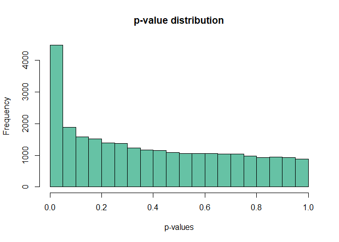<!-- -->

``` r
#define comparisons
comp1_sig = topTable(macrophage_fit, coef="comparison1", number = Inf)
comp2_sig = topTable(macrophage_fit, coef="comparison2", number = Inf)
comp3_sig = topTable(macrophage_fit, coef="comparison3", number = Inf)
comp4_sig = topTable(macrophage_fit, coef="comparison4", number = Inf)

#remove duplicate entrez
comp1_sig <- comp1_sig %>%
  group_by(ENTREZID) %>%
  sample_n(1) %>% ungroup()

PROBEID_duplicates_1 <- subset(comp1_sig,duplicated(ENTREZID)) %>% as.data.frame() %>% select(PROBEID)
palmieri_final_1 <- subset(palmieri_final, !(fData(palmieri_final)$PROBEID %in% PROBEID_duplicates_1))


comp2_sig <- comp2_sig %>%
  group_by(ENTREZID) %>%
  sample_n(1) %>% ungroup()

PROBEID_duplicates_2 <- subset(comp2_sig,duplicated(ENTREZID)) %>% as.data.frame() %>% select(PROBEID)
palmieri_final_2 <- subset(palmieri_final, !(fData(palmieri_final)$PROBEID %in% PROBEID_duplicates_2))


comp3_sig <- comp3_sig %>%
  group_by(ENTREZID) %>%
  sample_n(1) %>% ungroup()

PROBEID_duplicates_3 <- subset(comp3_sig,duplicated(ENTREZID)) %>% as.data.frame() %>% select(PROBEID)
palmieri_final_3 <- subset(palmieri_final, !(fData(palmieri_final)$PROBEID %in% PROBEID_duplicates_3))


comp4_sig <- comp4_sig %>%
  group_by(ENTREZID) %>%
  sample_n(1) %>% ungroup()

PROBEID_duplicates_4 <- subset(comp4_sig,duplicated(ENTREZID)) %>% as.data.frame() %>% select(PROBEID)
palmieri_final_4 <- subset(palmieri_final, !(fData(palmieri_final)$PROBEID %in% PROBEID_duplicates_4))
```

## Differentially expressed genes

``` r
#Employing respective FDR and logFC cutoffs
DE_comp1 = subset(comp1_sig, adj.P.Val < 0.05 & (logFC > 0.58 | logFC < -0.58))
DE_comp2 = subset(comp2_sig, adj.P.Val < 0.05 & (logFC > 0.58 | logFC < -0.58))
DE_comp3 = subset(comp3_sig, adj.P.Val < 0.05 & (logFC > 0.58 | logFC < -0.58))
DE_comp4 = subset(comp4_sig, adj.P.Val < 0.05 & (logFC > 0.58 | logFC < -0.58))

head(DE_comp1)
```

    ## # A tibble: 6 × 10
    ##   PROBEID  SYMBOL   GENEN…¹ ENTRE…²  logFC AveExpr     t P.Value adj.P…³       B
    ##   <chr>    <chr>    <chr>   <chr>    <dbl>   <dbl> <dbl>   <dbl>   <dbl>   <dbl>
    ## 1 16874922 SIGLEC14 sialic… 100049…  0.982    7.66  6.51 1.41e-5 0.00203  3.42  
    ## 2 17001040 GNPDA1   glucos… 10007   -0.884    5.14 -5.75 5.13e-5 0.00462  2.15  
    ## 3 16742106 KCNE3    potass… 10008   -0.949    4.94 -4.50 5.04e-4 0.0201  -0.115 
    ## 4 16944736 LINC020… long i… 100129… -1.51     6.48 -4.57 4.41e-4 0.0185   0.0174
    ## 5 16874512 SNAR-D   small … 100170…  2.03     3.46  4.05 1.21e-3 0.0357  -0.981 
    ## 6 16763608 PCED1B-… PCED1B… 100233… -0.988    4.74 -3.84 1.81e-3 0.0463  -1.37  
    ## # … with abbreviated variable names ¹​GENENAME, ²​ENTREZID, ³​adj.P.Val

``` r
head(DE_comp2)
```

    ## # A tibble: 6 × 10
    ##   PROBEID  SYMBOL    GENEN…¹ ENTRE…²  logFC AveExpr     t P.Value adj.P…³      B
    ##   <chr>    <chr>     <chr>   <chr>    <dbl>   <dbl> <dbl>   <dbl>   <dbl>  <dbl>
    ## 1 16768936 TMPO-AS1  TMPO a… 100128… -1.08     6.59 -4.67 3.66e-4  0.0296  0.313
    ## 2 16750761 TROAP     trophi… 10024   -1.02     5.09 -5.21 1.33e-4  0.0144  1.29 
    ## 3 16857192 CHAF1A    chroma… 10036   -0.693    6.37 -4.43 5.73e-4  0.0402 -0.120
    ## 4 17107676 MAMLD1    master… 10046    0.933    4.10  4.37 6.43e-4  0.0432 -0.233
    ## 5 17125360 LINC00963 long i… 100506…  0.829    5.25  5.24 1.26e-4  0.0138  1.34 
    ## 6 16829472 RPH3AL-A… RPH3AL… 100506… -1.19     3.89 -5.36 1.01e-4  0.0119  1.55 
    ## # … with abbreviated variable names ¹​GENENAME, ²​ENTREZID, ³​adj.P.Val

``` r
head(DE_comp3)
```

    ## # A tibble: 6 × 10
    ##   PROBEID  SYMBOL  GENEN…¹ ENTRE…²  logFC AveExpr     t P.Value adj.P…³        B
    ##   <chr>    <chr>   <chr>   <chr>    <dbl>   <dbl> <dbl>   <dbl>   <dbl>    <dbl>
    ## 1 16874922 SIGLEC… sialic… 100049… -0.683    7.66 -4.52 4.81e-4 0.0239  -0.00801
    ## 2 17001040 GNPDA1  glucos… 10007    0.656    5.14  4.27 7.90e-4 0.0316  -0.494  
    ## 3 16970068 SNHG8   small … 100093…  0.930    6.53  5.23 1.29e-4 0.0108   1.28   
    ## 4 17078999 C8orf88 chromo… 100127… -0.981    2.40 -4.37 6.46e-4 0.0283  -0.297  
    ## 5 16768936 TMPO-A… TMPO a… 100128… -1.35     6.59 -5.84 4.34e-5 0.00534  2.35   
    ## 6 16688665 PIGK    phosph… 10026    0.662    7.61  4.88 2.45e-4 0.0157   0.651  
    ## # … with abbreviated variable names ¹​GENENAME, ²​ENTREZID, ³​adj.P.Val

``` r
head(DE_comp4)
```

    ## # A tibble: 0 × 10
    ## # … with 10 variables: PROBEID <chr>, SYMBOL <chr>, GENENAME <chr>,
    ## #   ENTREZID <chr>, logFC <dbl>, AveExpr <dbl>, t <dbl>, P.Value <dbl>,
    ## #   adj.P.Val <dbl>, B <dbl>

``` r
#really now diff. expressed genes in comparison hLF+LPS vs. hLF, or just a LogFc-problem?
DE_comp4 = subset(comp4_sig, adj.P.Val < 0.05)
head(DE_comp4)
```

    ## # A tibble: 0 × 10
    ## # … with 10 variables: PROBEID <chr>, SYMBOL <chr>, GENENAME <chr>,
    ## #   ENTREZID <chr>, logFC <dbl>, AveExpr <dbl>, t <dbl>, P.Value <dbl>,
    ## #   adj.P.Val <dbl>, B <dbl>

``` r
# -> Really no differentially expressed genes after p-value adjustment due to multiple comparisons.

#second version prepared in case needed for additional downstream analyses
DE_comp1b = subset(comp1_sig, adj.P.Val < 0.05 & (logFC > 1.58 | logFC < -1.58 ))
DE_comp2b = subset(comp2_sig, adj.P.Val < 0.05 & (logFC > 1.58 | logFC < -1.58 ))
DE_comp3b = subset(comp3_sig, adj.P.Val < 0.05 & (logFC > 1.58 | logFC < -1.58 ))


head(DE_comp1b)
```

    ## # A tibble: 6 × 10
    ##   PROBEID  SYMBOL    GENENAME ENTRE…¹ logFC AveExpr     t P.Value adj.P…²      B
    ##   <chr>    <chr>     <chr>    <chr>   <dbl>   <dbl> <dbl>   <dbl>   <dbl>  <dbl>
    ## 1 16874512 SNAR-D    small N… 100170…  2.03    3.46  4.05 1.21e-3 3.57e-2 -0.981
    ## 2 16850650 GAPLINC   gastric… 100505… -2.21    6.52 -5.49 8.13e-5 6.26e-3  1.69 
    ## 3 16807195 RASGRP1   RAS gua… 10125    2.06    4.32  5.61 6.53e-5 5.44e-3  1.91 
    ## 4 16857136 EBI3      Epstein… 10148    3.93    7.12 12.1  9.02e-9 9.27e-6 10.4  
    ## 5 16887237 DHRS9     dehydro… 10170   -1.93    4.49 -6.11 2.75e-5 3.15e-3  2.76 
    ## 6 16720799 LINC01150 long in… 101927… -1.86    4.51 -5.65 6.09e-5 5.20e-3  1.98 
    ## # … with abbreviated variable names ¹​ENTREZID, ²​adj.P.Val

``` r
head(DE_comp2b)
```

    ## # A tibble: 6 × 10
    ##   PROBEID  SYMBOL GENENAME     ENTRE…¹ logFC AveExpr     t P.Value adj.P…²     B
    ##   <chr>    <chr>  <chr>        <chr>   <dbl>   <dbl> <dbl>   <dbl>   <dbl> <dbl>
    ## 1 16997816 EDIL3  EGF like re… 10085    2.09    4.46  5.02 1.89e-4 1.89e-2 0.953
    ## 2 16989636 KIF20A kinesin fam… 10112   -2.06    6.94 -9.81 1.23e-7 2.01e-4 7.80 
    ## 3 16664569 CDKN2C cyclin depe… 1031    -1.75    5.09 -9.34 2.23e-7 2.70e-4 7.27 
    ## 4 17059323 SEMA3A semaphorin … 10371    1.81    5.22  6.81 8.63e-6 3.23e-3 3.91 
    ## 5 16850517 NDC80  NDC80 kinet… 10403   -1.82    5.44 -6.72 9.91e-6 3.53e-3 3.78 
    ## 6 16978568 CENPE  centromere … 1062    -1.59    6.16 -6.65 1.11e-5 3.77e-3 3.67 
    ## # … with abbreviated variable names ¹​ENTREZID, ²​adj.P.Val

``` r
head(DE_comp3b)
```

    ## # A tibble: 6 × 10
    ##   PROBEID  SYMBOL     GENEN…¹ ENTRE…² logFC AveExpr     t P.Value adj.P…³      B
    ##   <chr>    <chr>      <chr>   <chr>   <dbl>   <dbl> <dbl>   <dbl>   <dbl>  <dbl>
    ## 1 16850650 GAPLINC    gastri… 100505…  1.64    6.52  4.07 1.16e-3 3.98e-2 -0.873
    ## 2 16997816 EDIL3      EGF li… 10085    2.19    4.46  5.28 1.18e-4 1.03e-2  1.37 
    ## 3 16807195 RASGRP1    RAS gu… 10125   -2.17    4.32 -5.92 3.82e-5 4.94e-3  2.47 
    ## 4 16857136 EBI3       Epstei… 10148   -2.77    7.12 -8.51 6.79e-7 3.70e-4  6.33 
    ## 5 16887237 DHRS9      dehydr… 10170    1.65    4.49  5.22 1.32e-4 1.09e-2  1.26 
    ## 6 17049996 LOC101927… unchar… 101927…  1.76    5.62  5.62 6.41e-5 6.91e-3  1.97 
    ## # … with abbreviated variable names ¹​GENENAME, ²​ENTREZID, ³​adj.P.Val

## Retrieving normalized expression values for differentially expressed genes

``` r
DE_comp1_SYMBOL <- DE_comp1 %>% select(PROBEID)
DE_comp2_SYMBOL <- DE_comp2 %>% select(PROBEID)
DE_comp3_SYMBOL <- DE_comp3 %>% select(PROBEID)

Merged_SYMBOL <- do.call("rbind", list(DE_comp1_SYMBOL, DE_comp2_SYMBOL, DE_comp3_SYMBOL))

Merged_SYMBOL_sliced <- Merged_SYMBOL %>% group_by(PROBEID) %>% dplyr::slice(n=1) %>% ungroup()
Merged_SYMBOL_vector <- c(Merged_SYMBOL_sliced)

d <- Biobase::exprs(palmieri_final)
PROBEID <- rownames(d)
rownames(d) <- NULL
d <- cbind(PROBEID,d) 
d <- as.data.frame(d)


Comp_palmieri <- d %>% inner_join(Merged_SYMBOL_sliced, by = "PROBEID")
Comp_palmieri <- tidyr::pivot_longer(Comp_palmieri, cols=2:17, names_to = "Experiment", values_to = "Expression")

#data wrangling + preparation
Comp_palmieri <- Comp_palmieri %>% mutate(Treatment = case_when(grepl("HLF_LPS", Experiment) ~ "HLF_LPS", grepl("MOCK", Experiment) ~"MOCK", grepl("HLF", Experiment)~"HLF", grepl("LPS", Experiment)~"LPS"))

Comp_palmieri <- Comp_palmieri %>% mutate(Proband = case_when(grepl("11", Experiment) ~ "1", grepl("12", Experiment) ~ "2", grepl("13", Experiment) ~ "3", grepl("14", Experiment) ~ "4"))


Comp_palmieri$Treatment <- as.factor(Comp_palmieri$Treatment)
Comp_palmieri$Proband <- as.factor(Comp_palmieri$Proband)
Comp_palmieri$Expression <- as.numeric(Comp_palmieri$Expression)
Comp_palmieri$Experiment <- as.factor(Comp_palmieri$Experiment)
```

## Heatmap (Figure 1C)

``` r
#wrangling + preparation
Comp_palmieri_PCA <- pivot_wider(Comp_palmieri, names_from = "PROBEID", values_from = "Expression")

Comp_palmieri_PCA_scaled <- scale(Comp_palmieri_PCA[4:1542])
Comp_palmieri_PCA_scaled <- t(Comp_palmieri_PCA_scaled)
Comp_palmieri_metadaten <- Comp_palmieri_PCA %>% select(Experiment, Treatment, Proband)

#Heatmap annotation
col_an = HeatmapAnnotation(Stimulation = Comp_palmieri_metadaten$Treatment,
                           col = list(Stimulation = c("MOCK" = "#DEC08B", "LPS" = "#CC6677", "HLF" = "#117733", "HLF_LPS" = "#6699CC")))
#Create  custom color palette
my_palette <-  colorRampPalette(c("#0765A0", "#FFF1E4","#C61700"))(100)

#Create heatmap using custom color palette
Figure_1C <- Heatmap(Comp_palmieri_PCA_scaled, show_row_names = FALSE, show_row_dend = TRUE, col = my_palette, 
        clustering_distance_columns = "euclidean", clustering_distance_rows = "euclidean",
        clustering_method_columns = "complete", clustering_method_rows = "complete",
        column_names_side = "top", column_dend_side = "top", column_dend_height = unit(4, "cm"), column_km = 3, column_gap =unit(3, "mm"),   column_title_gp = gpar(fontsize = 10),column_title = c("LPS&HLF or HLF", "Control", "LPS"), top_annotation = col_an)


print(Figure_1C)
```

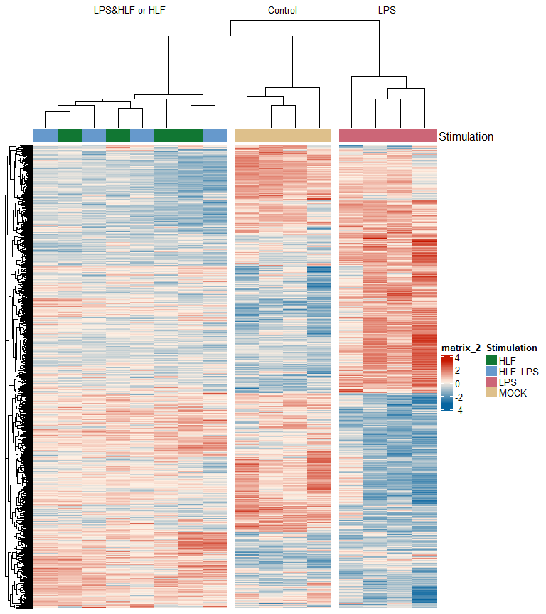<!-- -->

``` r
#Export as vector graphic
graph2svg(Figure_1C, file = "Figure_1C", width = 5, height = 6)
```

    ## Exported graph as Figure_1C.svg

## PCA (Figure 1E)

``` r
#Calculate PCA
X <- PCA(Comp_palmieri_PCA [4:1542], graph = FALSE)

#Create PCA
Figure_1E <- fviz_pca_ind(X, geom.ind = "point", 
             col.ind = Comp_palmieri_PCA$Treatment,
             fill.ind = Comp_palmieri_PCA$Treatment,pointshape = 21, pointsize = 3,
             palette = c("#117733", "#6699CC", "#CC6677", "#DEC08B"), alpha.var ="contrib",
             addEllipses = TRUE, # Concentration ellipses
             ellipse.type = "confidence", ellipse.alpha = 0.4,
             legend.title = "Groups", mean.point = FALSE, axes.linetype = "blank") + theme_bw() + labs(x = "PC1 (44.4%)", y = "PC2 (26,2%)") + theme(axis.text.y=element_text(size=8), 
                                                                                                                                                  axis.text.x=element_text(size=8), 
                                                                                                                                                  axis.title = element_text(size = 10, face = "bold"), 
                                                                                                                                                  legend.title = element_blank(),
                                                                                                                                                  legend.text = element_text(size = 10))
print(Figure_1E)
```

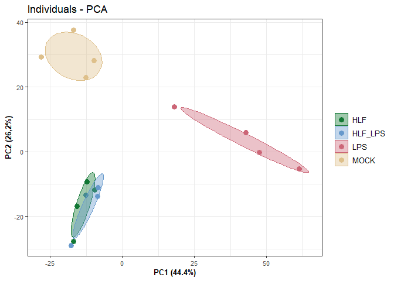<!-- -->

``` r
#Export as vector graphic
graph2svg(Figure_1E, file = "Figure_1E")
```

    ## Exported graph as Figure_1E.svg

## Volcano plot (Supplementary Figure 1A)

``` r
#data preparation/wrangling
comp4_sig$SYMBOL <- as.factor(comp4_sig$SYMBOL)
comp4_sig <- comp4_sig %>% as.data.frame()
rownames(comp4_sig) <- comp4_sig$SYMBOL

#Enhancedvolcano_1
Fig1_Sup <- EnhancedVolcano(comp4_sig,
                lab = rownames(comp4_sig),
                x = 'logFC',
                y = 'P.Value',
                title = 'N061011 versus N61311',
                pCutoff = 0.05,
                FCcutoff = 0.58)

print(Fig1_Sup)
```

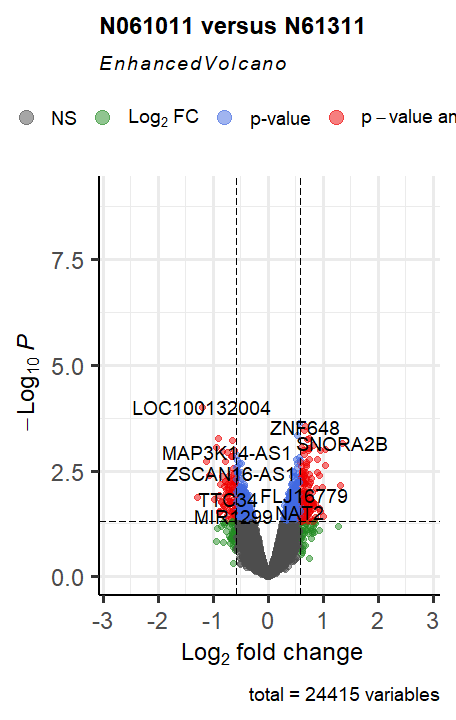<!-- -->

``` r
#Export as vector graphic
graph2svg(Fig1_Sup, file = "Fig1_Sup", width = 4, height = 7)
```

    ## Exported graph as Fig1_Sup.svg

``` r
#Enhancedvolcano_2
Fig2_Sup <- EnhancedVolcano(comp4_sig,
                lab = rownames(comp4_sig),
                x = 'logFC',
                y = 'adj.P.Val',
                title = 'N061011 versus N61311',
                pCutoff = 0.05,
                FCcutoff = 0.58,
                ylim = c(0, 10))

print(Fig2_Sup)
```

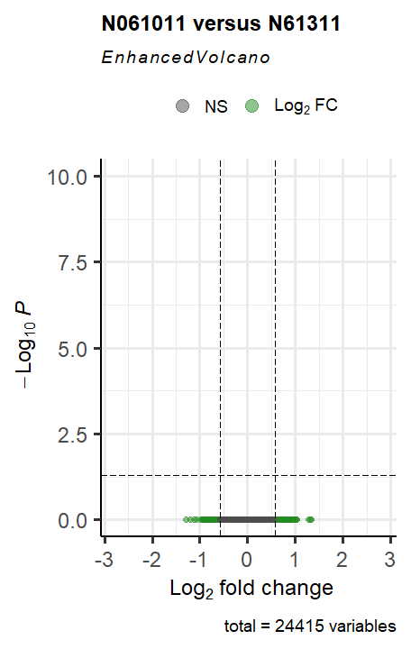<!-- -->

``` r
#Export as vector graphic
graph2svg(Fig2_Sup, file = "Fig2_Sup", width = 4, height = 7)
```

    ## Exported graph as Fig2_Sup.svg

## Venn Diagram (Figure 1D)

``` r
x <- list(
  "uMϕ+LPS vs. uMϕ" = DE_comp1$GENENAME, 
  "hMϕ vs. uMϕ" = DE_comp2$GENENAME, 
 "hMϕ +LPS vs. uMϕ+LPS" = DE_comp3$GENENAME
 )

venn.diagram(x,
             fill = c("#CC6677", "#117733","#6699CC") , filename = "Figure_1D.png") 
```

    ## [1] 1

## Get heatmap of 354 genes overlapping in Venn Diagramm (Supplementary Figure 3B/C)

``` r
#Get intersect values of Venn-Diagram (genes) + data wrangling
intersect <- calculate.overlap(x)
intersect_analysis <- intersect$a4 %>% as.data.frame()
colnames(intersect_analysis) <- c("GENENAME")
annotation_ProbeId <- DE_comp1 %>% select(SYMBOL, PROBEID, GENENAME)

#Get expression data on intersect genes for all samples
intersect_analysis_annotated <- intersect_analysis %>% left_join(annotation_ProbeId, by = "GENENAME") %>% select(PROBEID, SYMBOL)
intersect_analysis_annotated <- intersect_analysis_annotated %>% left_join(Comp_palmieri, by = "PROBEID")

#Prepare data for heatmap
intersect_analysis_annotated_wider <- intersect_analysis_annotated %>% filter(Treatment != "MOCK") %>%  select(-SYMBOL) %>% pivot_wider(names_from = "PROBEID", values_from = "Expression")
intersect_analysis_annotated_wider_scaled <- scale(intersect_analysis_annotated_wider[4:357])
intersect_analysis_annotated_wider_scaled <- t(intersect_analysis_annotated_wider_scaled)
intersect_analysis_annotated_wider_metadaten <- intersect_analysis_annotated_wider %>% select(Experiment, Treatment, Proband)

#Heatmap annotation
col_an = HeatmapAnnotation(Stimulation = intersect_analysis_annotated_wider_metadaten$Treatment,
                           col = list(Stimulation = c("LPS" = "#CC6677", "HLF" = "#117733", "HLF_LPS" = "#6699CC")))

#Create  custom color palette
my_palette <-  colorRampPalette(c("#0765A0", "#FFF1E4","#C61700"))(100)

#Create heatmap
Figure_supp3 <- Heatmap(intersect_analysis_annotated_wider_scaled, show_row_names = FALSE, show_row_dend = TRUE, col = my_palette,
                     clustering_distance_columns = "euclidean", clustering_distance_rows = "euclidean",
                     clustering_method_columns = "complete", clustering_method_rows = "complete",
                     column_names_side = "top", column_dend_side = "top", column_dend_height = unit(4, "cm"), column_km = 3, column_gap =unit(3, "mm"),   column_title_gp = gpar(fontsize = 10),column_title = c("LPS&HLF or HLF", "Control", "LPS"), top_annotation = col_an)

print(Figure_supp3)
```

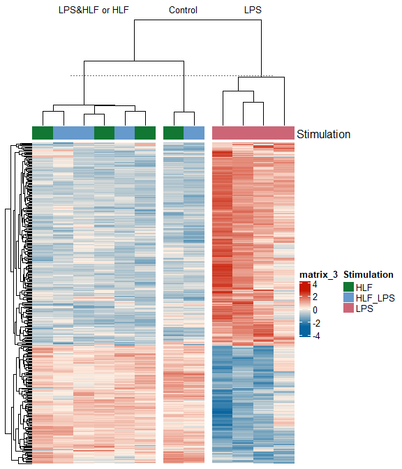<!-- -->

``` r
#Export as vector graphic
graph2svg(Figure_supp3, file = "Figure_supp3", width = 5, height = 6)
```

    ## Exported graph as Figure_supp3.svg

## Bar Chart (Figure 1B)

``` r
#gene counts
summary(DE_comp1$logFC > 0.58)
```

    ##    Mode   FALSE    TRUE 
    ## logical     481     490

``` r
summary(DE_comp2$logFC > 0.58)
```

    ##    Mode   FALSE    TRUE 
    ## logical     238     168

``` r
summary(DE_comp3$logFC > 0.58)
```

    ##    Mode   FALSE    TRUE 
    ## logical     463     360

``` r
summary(DE_comp1$logFC < 0.58)
```

    ##    Mode   FALSE    TRUE 
    ## logical     490     481

``` r
summary(DE_comp2$logFC < 0.58)
```

    ##    Mode   FALSE    TRUE 
    ## logical     168     238

``` r
summary(DE_comp3$logFC < 0.58)
```

    ##    Mode   FALSE    TRUE 
    ## logical     360     463

``` r
#manually compute it
Incubation <- c("LPS vs. M-CSF", "LPS vs. M-CSF", "HLF vs. M-CSF", "HLF vs. M-CSF", "HLF + LPS vs. LPS", "HLF + LPS vs. LPS", "HLF + LPS vs. HLF", "HLF + LPS vs. HLF")
Count <- c(481,490,238,168,463,360,0,0)
value <- c("neg", "pos", "neg", "pos", "neg", "pos", "neg", "pos")
value2 <- c(481, 971, 238, 406, 463, 823, 0, 0)

Count_diffexp <- data.frame(Incubation, Count, value, value2)

#Create barchart
Figure_1B <- ggplot(Count_diffexp, aes(x = Incubation, y = Count, fill = value)) + 
  scale_fill_manual(values = c("#6699CC", "#CC6677"), labels = c("negative", "positive")) + 
  theme_bw()  +  
  geom_col(colour = "black", width = 0.7, position = position_stack(reverse = TRUE)) + 
  geom_text(aes(y = (value2), label = Count), colour = "white", size = 5, vjust = 1.5) +
  theme(axis.text=element_text(size=8), 
        axis.title = element_text(size = 10,  face = "bold"), 
        legend.title = element_blank(),
        legend.text = element_text(size = 10))

print(Figure_1B)
```

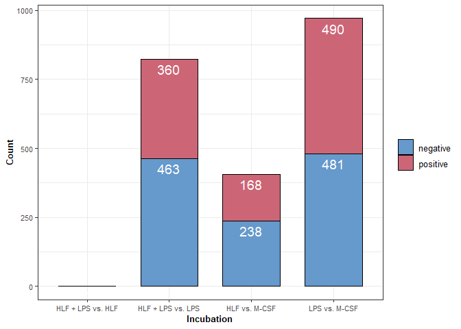<!-- -->

``` r
#Export as vector graphic
graph2svg(Figure_1B, file = "Figure_1B",  width = 5.2, height = 3.3)
```

    ## Exported graph as Figure_1B.svg

# Enrichment analysis

## Selecting adequate background genes

``` r
#Background matching:
comp1_sig <- as.data.frame(comp1_sig)
rownames(comp1_sig) <- comp1_sig$PROBEID

comp2_sig <- as.data.frame(comp2_sig)
rownames(comp2_sig) <- comp2_sig$PROBEID

comp3_sig <- as.data.frame(comp3_sig)
rownames(comp3_sig) <- comp3_sig$PROBEID


comp1_sig_x <- subset(comp1_sig, adj.P.Val < 0.1)$PROBEID
comp2_sig_x <- subset(comp2_sig, adj.P.Val < 0.1)$PROBEID
comp3_sig_x <- subset(comp3_sig, adj.P.Val < 0.1)$PROBEID
#comp4_sig_x <- subset(comp4_sig, adj.P.Val < 0.1)$PROBEID


back_genes_comp1 <- genefilter::genefinder(palmieri_final_1, 
                                         as.character(comp1_sig_x), 
                                         method = "manhattan", scale = "none")
back_genes_comp1 <- sapply(back_genes_comp1, function(x)x$indices)
back_genes_1 <- featureNames(palmieri_final_1)[back_genes_comp1]
back_genes_1 <- setdiff(back_genes_1, comp1_sig_x)
intersect(back_genes_1, comp1_sig_x)
```

    ## character(0)

``` r
length(back_genes_1)
```

    ## [1] 10123

``` r
multidensity(list(
  all = comp1_sig[,"AveExpr"] ,
  fore = comp1_sig[comp1_sig_x , "AveExpr"],
  back = comp1_sig[rownames(comp1_sig) %in% back_genes_1, "AveExpr"]),
  col = c("#e46981", "#ae7ee2", "#a7ad4a"),
  xlab = "mean expression",
  main = "DE genes for macrophage-background-matching")
```

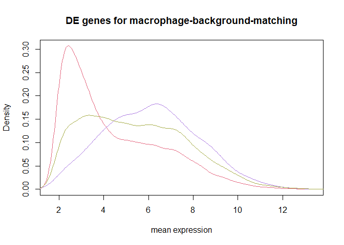<!-- -->

``` r
back_genes_comp2 <- genefilter::genefinder(palmieri_final_2, 
                                           as.character(comp2_sig_x), 
                                           method = "manhattan", scale = "none")
back_genes_comp2 <- sapply(back_genes_comp2, function(x)x$indices)
back_genes_2 <- featureNames(palmieri_final_2)[back_genes_comp2]
back_genes_2 <- setdiff(back_genes_2, comp2_sig_x)
intersect(back_genes_2, comp2_sig_x)
```

    ## character(0)

``` r
length(back_genes_2)
```

    ## [1] 5521

``` r
multidensity(list(
  all = comp2_sig[,"AveExpr"] ,
  fore = comp2_sig[comp2_sig_x , "AveExpr"],
  back = comp2_sig[rownames(comp2_sig) %in% back_genes_2, "AveExpr"]),
  col = c("#e46981", "#ae7ee2", "#a7ad4a"),
  xlab = "mean expression",
  main = "DE genes for macrophage-background-matching")
```

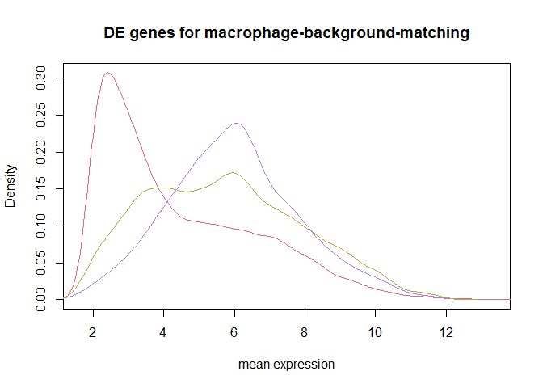<!-- -->

``` r
back_genes_comp3 <- genefilter::genefinder(palmieri_final_3, 
                                           as.character(comp3_sig_x), 
                                           method = "manhattan", scale = "none")
back_genes_comp3 <- sapply(back_genes_comp3, function(x)x$indices)
back_genes_3 <- featureNames(palmieri_final_3)[back_genes_comp3]
back_genes_3 <- setdiff(back_genes_3, comp3_sig_x)
intersect(back_genes_3, comp3_sig_x)
```

    ## character(0)

``` r
length(back_genes_3)
```

    ## [1] 8715

``` r
multidensity(list(
  all = comp3_sig[,"AveExpr"] ,
  fore = comp3_sig[comp3_sig_x , "AveExpr"],
  back = comp3_sig[rownames(comp3_sig) %in% back_genes_3, "AveExpr"]),
  col = c("#e46981", "#ae7ee2", "#a7ad4a"),
  xlab = "mean expression",
  main = "DE genes for macrophage-background-matching")
```

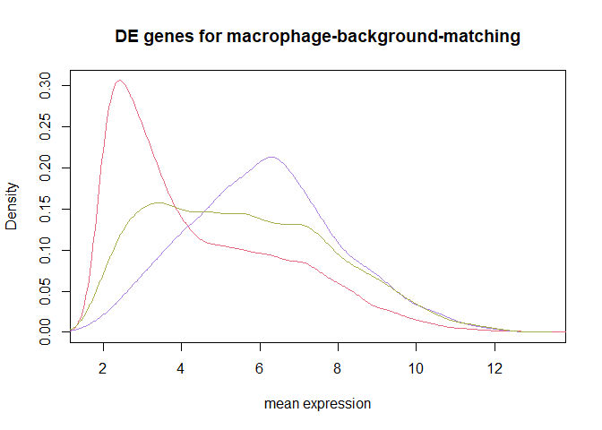<!-- -->

## Performing enrichment analysis using Reactome pathway database

``` r
#LPS
entrez_ids_1 <- mapIds(hugene21sttranscriptcluster.db, 
                     keys = rownames(comp1_sig), 
                     keytype = "PROBEID",
                     column = "ENTREZID")
```

    ## 'select()' returned 1:1 mapping between keys and columns

``` r
reactome_enrich_1 <- enrichPathway(gene = entrez_ids_1[comp1_sig_x], 
                                 universe = entrez_ids_1[c(comp1_sig_x, 
                                                         back_genes_1)],
                                 organism = "human",
                                 pvalueCutoff = 0.05,
                                 qvalueCutoff = 0.9, 
                                 readable = TRUE)

reactome_enrich_1@result$Description <- paste0(str_sub(
  reactome_enrich_1@result$Description))

reactome_enrich_1 <- pairwise_termsim(reactome_enrich_1)

#HLF
entrez_ids_2<- mapIds(hugene21sttranscriptcluster.db, 
                      keys = rownames(comp2_sig), 
                      keytype = "PROBEID",
                      column = "ENTREZID")
```

    ## 'select()' returned 1:1 mapping between keys and columns

``` r
reactome_enrich_2 <- enrichPathway(gene = entrez_ids_2[comp2_sig_x], 
                                   universe = entrez_ids_2[c(comp2_sig_x, 
                                                             back_genes_2)],
                                   organism = "human",
                                   pvalueCutoff = 0.05,
                                   qvalueCutoff = 0.9, 
                                   readable = TRUE)

reactome_enrich_2@result$Description <- paste0(str_sub(
  reactome_enrich_2@result$Description))

reactome_enrich_2 <- pairwise_termsim(reactome_enrich_2)

#HLF-LPS
entrez_ids_3<- mapIds(hugene21sttranscriptcluster.db, 
                      keys = rownames(comp3_sig), 
                      keytype = "PROBEID",
                      column = "ENTREZID")
```

    ## 'select()' returned 1:1 mapping between keys and columns

``` r
reactome_enrich_3 <- enrichPathway(gene = entrez_ids_3[comp3_sig_x], 
                                   universe = entrez_ids_3[c(comp3_sig_x, 
                                                             back_genes_3)],
                                   organism = "human",
                                   pvalueCutoff = 0.05,
                                   qvalueCutoff = 0.9, 
                                   readable = TRUE)

reactome_enrich_3@result$Description <- paste0(str_sub(
  reactome_enrich_3@result$Description))

reactome_enrich_3 <- pairwise_termsim(reactome_enrich_3)
```

## Prepare data for GoPlot

``` r
#LPS
id <- reactome_enrich_1$ID
category_reactome_1 <- geneInCategory(reactome_enrich_1)[id]
a<-plyr::ldply(category_reactome_1, rbind)
a <- t(a)
a <- as.data.frame(a)

b = a[-1,]
colnames(a) = a[1,]

entries = unlist(b,use.names=FALSE)
entries = entries[!is.na(entries)]
entries = unique(entries)
a = a[-1,]


genes <- data.frame(entries)
names(genes) <- c("gene")

x <- data.frame(matrix(NA, nrow = nrow(genes), ncol = 1))
x <- cbind(genes, x)


pathway <- colnames(a)

for(i in pathway){
  b <- data.frame(a[[i]])
  colnames(b) <- c("gene")

  b[[i]] <- ifelse(is.na(b$gene), 0, 1)

  x <- left_join(x, b, by = "gene")
  
  
}
x <- x[,-2]

symbols_comp1 <- comp1_sig %>% select("SYMBOL", "logFC")
colnames(symbols_comp1) = c("gene", "logFC")
x <-  left_join(x, symbols_comp1, by = "gene")
GoPlot_1 <- x

GoPlot_1[is.na(GoPlot_1)] <- 0
GoPlot_1_genes <- GoPlot_1 %>% select("gene", "logFC")
GoPlot_1_process <- GoPlot_1 %>% select(-"gene", -"logFC")


v <- reactome_enrich_1@result %>% dplyr::group_by(ID) %>% dplyr::slice(1L) %>% ungroup() %>% select(ID, Description)
col_GoPlot_1 <- colnames(GoPlot_1) %>% as.data.frame()
colnames(col_GoPlot_1) <- "ID"

col_GoPlot_1 <- col_GoPlot_1 %>% inner_join(v, by = "ID")
col_GoPlot_1 = col_GoPlot_1[['Description']]
col_GoPlot_1 <- c("gene", col_GoPlot_1, "logFC")

colnames(GoPlot_1) <- col_GoPlot_1
rm(col_GoPlot_1)


#HLF
id <- reactome_enrich_2$ID
category_reactome_2 <- geneInCategory(reactome_enrich_2)[id]
a<-plyr::ldply(category_reactome_2, rbind)
a <- t(a)
a <- as.data.frame(a)

b = a[-1,]
colnames(a) = a[1,]

entries = unlist(b,use.names=FALSE)
entries = entries[!is.na(entries)]
entries = unique(entries)
a = a[-1,]


genes <- data.frame(entries)
names(genes) <- c("gene")

x <- data.frame(matrix(NA, nrow = nrow(genes), ncol = 1))
x <- cbind(genes, x)


pathway <- colnames(a)

for(i in pathway){
  b <- data.frame(a[[i]])
  colnames(b) <- c("gene")
  
  b[[i]] <- ifelse(is.na(b$gene), 0, 1)
  
  x <- left_join(x, b, by = "gene")
  
  
}
x <- x[,-2]

symbols_comp2 <- comp2_sig %>% select("SYMBOL", "logFC")
colnames(symbols_comp2) = c("gene", "logFC")
x <-  left_join(x, symbols_comp2, by = "gene")
GoPlot_2 <- x

GoPlot_2[is.na(GoPlot_2)] <- 0
GoPlot_2_genes <- GoPlot_2 %>% select("gene", "logFC")
GoPlot_2_process <- GoPlot_2 %>% select(-"gene", -"logFC")


v <- reactome_enrich_2@result %>% dplyr::group_by(ID) %>% dplyr::slice(1L) %>% ungroup() %>% select(ID, Description)
col_GoPlot_2 <- colnames(GoPlot_2) %>% as.data.frame()
colnames(col_GoPlot_2) <- "ID"

col_GoPlot_2 <- col_GoPlot_2 %>% inner_join(v, by = "ID")
col_GoPlot_2 = col_GoPlot_2[['Description']]
col_GoPlot_2 <- c("gene", col_GoPlot_2, "logFC")

colnames(GoPlot_2) <- col_GoPlot_2
rm(col_GoPlot_2)


#HLF+LPS
id <- reactome_enrich_3$ID
category_reactome_3 <- geneInCategory(reactome_enrich_3)[id]
a<-plyr::ldply(category_reactome_3, rbind)
a <- t(a)
a <- as.data.frame(a)

b = a[-1,]
colnames(a) = a[1,]

entries = unlist(b,use.names=FALSE)
entries = entries[!is.na(entries)]
entries = unique(entries)
a = a[-1,]

Reactome_genes_HLF_LPS <- a


genes <- data.frame(entries)
names(genes) <- c("gene")

x <- data.frame(matrix(NA, nrow = nrow(genes), ncol = 1))
x <- cbind(genes, x)


pathway <- colnames(a)

for(i in pathway){
  b <- data.frame(a[[i]])
  colnames(b) <- c("gene")
  
  b[[i]] <- ifelse(is.na(b$gene), 0, 1)
  
  x <- left_join(x, b, by = "gene")
  
  
}
x <- x[,-2]

symbols_comp3 <- comp3_sig %>% select("SYMBOL", "logFC")
colnames(symbols_comp3) = c("gene", "logFC")
x <-  left_join(x, symbols_comp3, by = "gene")
GoPlot_3 <- x

GoPlot_3[is.na(GoPlot_3)] <- 0
GoPlot_3_genes <- GoPlot_3 %>% select("gene", "logFC")
GoPlot_3_process <- GoPlot_3 %>% select(-"gene", -"logFC")


v <- reactome_enrich_3@result %>% dplyr::group_by(ID) %>% dplyr::slice(1L) %>% ungroup() %>% select(ID, Description)
col_GoPlot_3 <- colnames(GoPlot_3) %>% as.data.frame()
colnames(col_GoPlot_3) <- "ID"

col_GoPlot_3 <- col_GoPlot_3 %>% inner_join(v, by = "ID")
col_GoPlot_3 = col_GoPlot_3[['Description']]
col_GoPlot_3 <- c("gene", col_GoPlot_3, "logFC")

colnames(GoPlot_3) <- col_GoPlot_3
rm(col_GoPlot_3)

#GoPlot_1_plot <- GoPlot_1 %>% select(c(1:11, 23))
#GoPlot_1_plot <- filter(GoPlot_1_plot,rowSums(GoPlot_1_plot[,2:11])!= 0)
#GoPlot_1_plot <- GoPlot_1_plot %>% filter(logFC > 1)
#GoPlot_1_plot <- GoPlot_1_plot %>%  column_to_rownames(var = "gene")


#prepare colors for later
color <- brewer.pal(10,"Spectral")
color2 <- viridis(10)
color3 <- viridis(8)
color6 <- viridis(6)
color7 <- viridis(7)
color9 <- viridis(9)
color11 <- viridis(11)
```

## Dotplot (Figure 2A)

``` r
#get all ENTREZ of DEG with logFC >/< 0.58 and adj.p.val < 0.1; mutate subgroup (positive/negative)
DE_comp1_pos = subset(comp1_sig, adj.P.Val < 0.1 & (logFC > 0.58)) %>% select(ENTREZID) %>% rename(Entrez = ENTREZID) %>% mutate(Group = "LPS") %>% mutate(subgroup = "positive") 
DE_comp1_neg = subset(comp1_sig, adj.P.Val < 0.1 & (logFC < -0.58)) %>% select(ENTREZID) %>% rename(Entrez = ENTREZID) %>% mutate(Group = "LPS") %>% mutate(subgroup = "negative")
DE_comp2_pos = subset(comp2_sig, adj.P.Val < 0.1 & (logFC > 0.58)) %>% select(ENTREZID) %>% rename(Entrez = ENTREZID) %>% mutate(Group = "HLF") %>% mutate(subgroup = "positive")
DE_comp2_neg = subset(comp2_sig, adj.P.Val < 0.1 & (logFC < -0.58)) %>% select(ENTREZID) %>% rename(Entrez = ENTREZID) %>% mutate(Group = "HLF") %>% mutate(subgroup = "negative")
DE_comp3_pos = subset(comp3_sig, adj.P.Val < 0.1 & (logFC > 0.58)) %>% select(ENTREZID) %>% rename(Entrez = ENTREZID) %>% mutate(Group = "LPS+HLF") %>% mutate(subgroup = "positive")
DE_comp3_neg = subset(comp3_sig, adj.P.Val < 0.1 & (logFC < -0.58)) %>% select(ENTREZID) %>% rename(Entrez = ENTREZID) %>% mutate(Group = "LPS+HLF") %>% mutate(subgroup = "negative")

all_DE_genes <- do.call("rbind", list(DE_comp1_pos, DE_comp1_neg, DE_comp2_pos, DE_comp2_neg, DE_comp3_pos, DE_comp3_neg)) %>% as.data.frame()

#get all data of DEG with same cutoff
DE_comp1_pos_exp = filter(comp1_sig, adj.P.Val < 0.1 & (logFC > 0.58)) 
DE_comp1_neg_exp = filter(comp1_sig, adj.P.Val < 0.1 & (logFC < -0.58))  
DE_comp2_pos_exp = filter(comp2_sig, adj.P.Val < 0.1 & (logFC > 0.58))  
DE_comp2_neg_exp = filter(comp2_sig, adj.P.Val < 0.1 & (logFC < -0.58))
DE_comp3_pos_exp = filter(comp3_sig, adj.P.Val < 0.1 & (logFC > 0.58))
DE_comp3_neg_exp = filter(comp3_sig, adj.P.Val < 0.1 & (logFC < -0.58))

all_DE_genes_exp <- rbind(DE_comp1_pos_exp, DE_comp1_neg_exp, DE_comp2_pos_exp, DE_comp2_neg_exp, DE_comp3_pos_exp, DE_comp3_neg_exp) %>% unlist() 
all_DE_genes_exp_2 <- all_DE_genes_exp %>% unique()

#get PROBEIDS with same cutoff
DE_comp1_pos_BG = subset(comp1_sig, adj.P.Val < 0.1 & (logFC > 0.58))$PROBEID
DE_comp1_neg_BG = subset(comp1_sig, adj.P.Val < 0.1 & (logFC < -0.58))$PROBEID
DE_comp2_pos_BG = subset(comp2_sig, adj.P.Val < 0.1 & (logFC > 0.58))$PROBEID 
DE_comp2_neg_BG = subset(comp2_sig, adj.P.Val < 0.1 & (logFC < -0.58))$PROBEID
DE_comp3_pos_BG = subset(comp3_sig, adj.P.Val < 0.1 & (logFC > 0.58))$PROBEID
DE_comp3_neg_BG = subset(comp3_sig, adj.P.Val < 0.1 & (logFC < -0.58))$PROBEID

comp1_BG<- c(DE_comp1_pos_BG, DE_comp1_neg_BG)
comp2_BG<- c(DE_comp2_pos_BG, DE_comp2_neg_BG)
comp3_BG<- c(DE_comp3_pos_BG, DE_comp3_neg_BG)

all_genes_BG_ID <- c(DE_comp1_pos_BG, DE_comp1_neg_BG,DE_comp2_pos_BG, DE_comp2_neg_BG, DE_comp3_pos_BG, DE_comp3_neg_BG) %>% unique()

#get all DEG in one DF
all_genes_BG <- do.call("rbind", list(comp1_sig, comp2_sig, comp3_sig)) %>% data.frame()


#Model Background genes for each condition
back_genes_comp1 <- genefilter::genefinder(palmieri_final_1, 
                                           as.character(comp1_BG), 
                                           method = "manhattan", scale = "none")
back_genes_comp1 <- sapply(back_genes_comp1, function(x)x$indices)
back_genes_1 <- featureNames(palmieri_final_1)[back_genes_comp1]
back_genes_1 <- setdiff(back_genes_1, comp1_BG)
intersect(back_genes_1, comp1_BG)
```

    ## character(0)

``` r
length(back_genes_1)
```

    ## [1] 9005

``` r
back_genes_comp2 <- genefilter::genefinder(palmieri_final_2, 
                                           as.character(comp2_BG), 
                                           method = "manhattan", scale = "none")
back_genes_comp2 <- sapply(back_genes_comp2, function(x)x$indices)
back_genes_2 <- featureNames(palmieri_final_2)[back_genes_comp2]
back_genes_2 <- setdiff(back_genes_2, comp2_BG)
intersect(back_genes_2, comp2_BG)
```

    ## character(0)

``` r
length(back_genes_2)
```

    ## [1] 5137

``` r
back_genes_comp3 <- genefilter::genefinder(palmieri_final_3, 
                                           as.character(comp3_BG), 
                                           method = "manhattan", scale = "none")
back_genes_comp3 <- sapply(back_genes_comp3, function(x)x$indices)
back_genes_3 <- featureNames(palmieri_final_3)[back_genes_comp3]
back_genes_3 <- setdiff(back_genes_3, comp3_BG)
intersect(back_genes_3, comp3_BG)
```

    ## character(0)

``` r
length(back_genes_3)
```

    ## [1] 7368

``` r
#get vector of all BG-genes
back_genes_cluster = c(back_genes_1, back_genes_2,back_genes_3)
back_genes_cluster = unique(back_genes_cluster)


#depict BG-matching
cancerTiming::multidensity(list(
  all = all_genes_BG[,"AveExpr"] ,
  fore = all_genes_BG[all_DE_genes_exp_2, "AveExpr"],
  back = all_genes_BG[rownames(all_genes_BG) %in% back_genes_cluster, "AveExpr"]),
  col = c("#e46981", "#ae7ee2", "#a7ad4a"),
  xlab = "mean expression",
  main = "DE genes background matching")
```

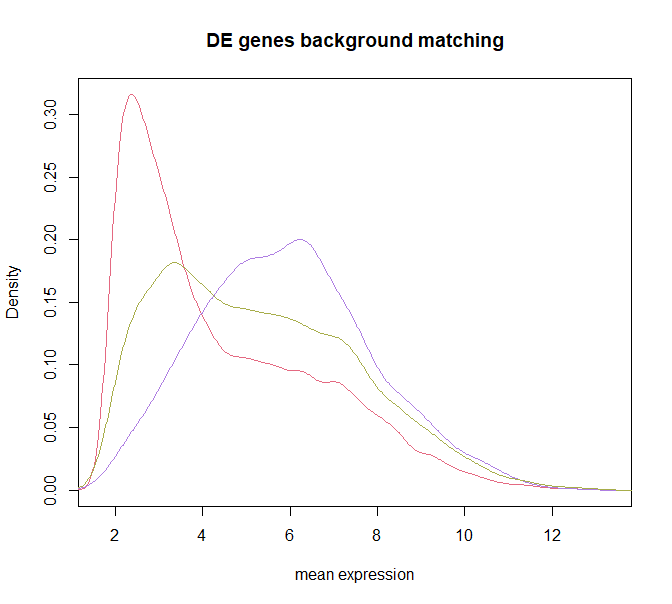<!-- -->

``` r
#annotate and prepare DEG for enrichment (ENTREZIDS)
entrez_ids_1_BG <- mapIds(hugene21sttranscriptcluster.db, 
                       keys = rownames(comp1_sig), 
                       keytype = "PROBEID",
                       column = "ENTREZID")
```

    ## 'select()' returned 1:1 mapping between keys and columns

``` r
entrez_ids_2_BG <- mapIds(hugene21sttranscriptcluster.db, 
                       keys = rownames(comp2_sig), 
                       keytype = "PROBEID",
                       column = "ENTREZID")
```

    ## 'select()' returned 1:1 mapping between keys and columns

``` r
entrez_ids_3_BG <- mapIds(hugene21sttranscriptcluster.db, 
                       keys = rownames(comp3_sig), 
                       keytype = "PROBEID",
                       column = "ENTREZID")
```

    ## 'select()' returned 1:1 mapping between keys and columns

``` r
entrez_ids_BG <- c(entrez_ids_1_BG, entrez_ids_2_BG, entrez_ids_3_BG)

#use compare-cluster function with formula for complex setup and costum-BG matching (universe)
xx.formula.twogroups <- compareCluster(Entrez~Group+subgroup, data=all_DE_genes,
                                       fun='enrichPathway', universe = entrez_ids_BG[c(all_genes_BG_ID, 
                                                                                      back_genes_cluster)])

#Plot Figure 2a using enrichplot
Figure_2A <- enrichplot::dotplot(xx.formula.twogroups, x="Group", label_format = 30, font.size = 8, showCategory = 6) + facet_grid(~subgroup)
print(Figure_2A)
```

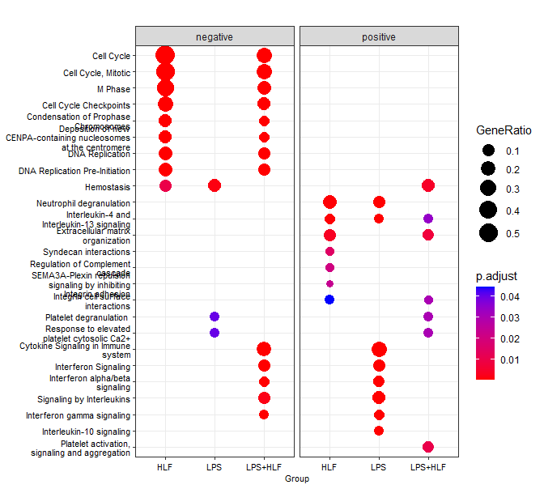<!-- -->

``` r
#Export as vector graphic for more comprehensive depiction later
graph2svg(Figure_2A, file = "Figure_2A", height = 8.5, width = 6.3)
```

    ## Exported graph as Figure_2A.svg

## Chord diagrams (Figure 2B and 2C)

``` r
#select relevant Pathways found in CompareCluster analysis and depict genes with log2FC higher/lower than 1.322 (in pairwise comparisons) that feed respective pathways

#HLF
GoPlot_dotplot_HLF1 <- GoPlot_2 %>% select(gene, `Cell Cycle`, `Cell Cycle, Mitotic`, "M Phase", `Cell Cycle Checkpoints`, `Condensation of Prophase Chromosomes`, `Deposition of new CENPA-containing nucleosomes at the centromere`, `DNA Replication`,
                                           `Interleukin-4 and Interleukin-13 signaling`, `Syndecan interactions`, logFC)
GoPlot_dotplot_HLF1 <- filter(GoPlot_dotplot_HLF1,rowSums(GoPlot_dotplot_HLF1[,2:10])!= 0)
GoPlot_dotplot_HLF1 <- GoPlot_dotplot_HLF1 %>% filter(logFC > 1.322 | logFC < - 1.322)
GoPlot_dotplot_HLF1 <- GoPlot_dotplot_HLF1 %>%  column_to_rownames(var = "gene")

Figure_2B <- GOChord(GoPlot_dotplot_HLF1, gene.order = 'logFC', ribbon.col = color9,  gene.space = 0.25, space = 0.005, border.size = 0.1, limit = c(0,0), gene.size = 2, lfc.col = c("#FF7A55","#FDFFB0", "#BAD4FF"))
print(Figure_2B)
```

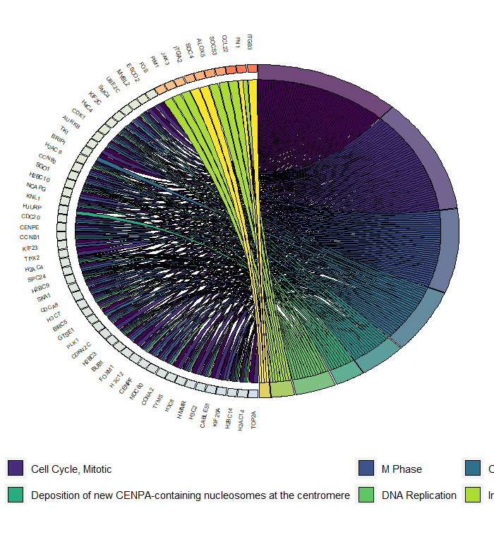<!-- -->

``` r
#Export as vector graphic
graph2svg(Figure_2B, file = "Figure_2B", height = 5.9, width = 4.5)
```

    ## Exported graph as Figure_2B.svg

``` r
#HLF+LPS
GoPlot_dotplot_HLF_LPS1 <- GoPlot_3 %>% select(gene, `Cytokine Signaling in Immune system`, `Interferon Signaling`, `Interferon alpha/beta signaling`, `Signaling by Interleukins`, `Interferon gamma signaling`, `Interleukin-4 and Interleukin-13 signaling`,
                                               `Extracellular matrix organization`, `Integrin cell surface interactions`, logFC)
GoPlot_dotplot_HLF_LPS1 <- filter(GoPlot_dotplot_HLF_LPS1,rowSums(GoPlot_dotplot_HLF_LPS1[,2:9])!= 0)
GoPlot_dotplot_HLF_LPS1 <- GoPlot_dotplot_HLF_LPS1 %>% filter(logFC > 1.322 | logFC < - 1.322)
GoPlot_dotplot_HLF_LPS1 <- GoPlot_dotplot_HLF_LPS1 %>%  column_to_rownames(var = "gene")


Figure_2C <- GOChord(GoPlot_dotplot_HLF_LPS1, gene.order = 'logFC', ribbon.col = color3, gene.space = 0.25, space = 0.005, border.size = 0.1, limit = c(0,0), gene.size = 2, lfc.col = c("#FF7A55","#FDFFB0", "#BAD4FF"))
print(Figure_2C)
```

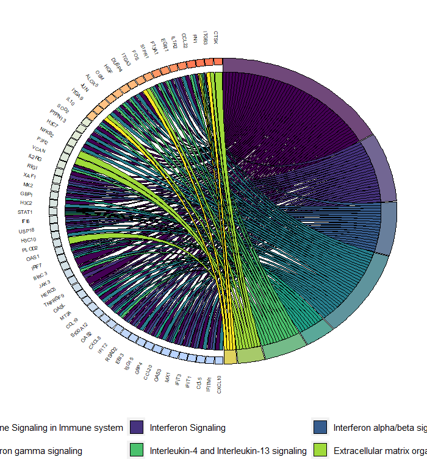<!-- -->

``` r
#Export as vector graphic
graph2svg(Figure_2C, file = "Figure_2C", height = 5.5, width = 4.6)
```

    ## Exported graph as Figure_2C.svg

# Transcription regulator target network inference RegEnrich

## Prepare input data

``` r
#get PROBEIDs and SYMBOLS
p_final_fData <- palmieri_final@featureData@data %>% select(PROBEID, SYMBOL)

#join with log2 norm.exp previously stored from palmieri_final in dataframe d to get a comprehensive df for RegEnrich
p_final_exp <- d %>% left_join(p_final_fData, by = "PROBEID") %>% select(-"PROBEID") 
p_final_exp <- p_final_exp[, c(17,1,2,3,4,5,6,7,8,9,10,11,12,13,14,15,16)]

#random duplicate removal
p_final_exp <- p_final_exp %>%
  group_by(SYMBOL) %>%
  sample_n(1) %>% as.data.frame()

#wrangling
rownames(p_final_exp) <- p_final_exp$SYMBOL
p_final_exp <-p_final_exp %>% select(-SYMBOL)
p_final_exp <- p_final_exp %>%  mutate_at(c(1:16), as.numeric)

#get phenodata
phenodata <- palmieri_final@phenoData@data

#get regulators from RegEnrich
data(TFs)
```

### Differential gene expression analysis with RegEnrich and “limma” and initialisation of RegenrichSet object

``` r
#prepare design matrix and contrasts
design = model.matrix(~0 + condition + proband, data = phenodata)
colnames(design) = c("MCSF", "MCSF_HLF", "MCSF_HLF_LPS", "MCSF_LPS", "proband2", "proband3", "proband4")

contrast_matrix_2 <- makeContrasts(comparison1 = MCSF_LPS - MCSF, 
                                   comparison2 = MCSF_HLF - MCSF, 
                                   comparison3 = MCSF_HLF_LPS - MCSF_LPS, 
                                   comparison4 = MCSF_HLF_LPS - MCSF_HLF, levels = design)

#RegenrichSet object: Method: Limma, COEN = Weighted gene coexpression network inference, enrichment method = Fisher's Exact Test
#for LPS vs M-CSF
object_LPS = RegenrichSet(expr = p_final_exp, 
                      colData = phenodata,
                      method = "limma",
                      design = design,
                      contrast = contrast_matrix_2,
                      coef = c("comparison1"),
                      networkConstruction = "COEN",
                      enrichTest = "FET",
                      trace=TRUE)

#for HLF vs M-CSF
object_HLF = RegenrichSet(expr = p_final_exp, 
                          colData = phenodata,
                          method = "limma",
                          design = design,
                          contrast = contrast_matrix_2,
                          coef = c("comparison2"),
                          networkConstruction = "COEN",
                          enrichTest = "FET")

#for HLF + LPS vs. M-CSF + LPS
object_LPS_HLF = RegenrichSet(expr = p_final_exp, 
                              colData = phenodata,
                              method = "limma",
                              design = design,
                              contrast = contrast_matrix_2,
                              coef = c("comparison3"),
                              networkConstruction = "COEN",
                              enrichTest = "FET")

#respecify parameters for differential expression analysis
object_LPS = regenrich_diffExpr(object_LPS, method = "limma")
object_HLF = regenrich_diffExpr(object_HLF, method = "limma")
object_LPS_HLF = regenrich_diffExpr(object_LPS_HLF, method = "limma")

print(object_LPS)
```

    ## RegenrichSet object 
    ##  assayData: 24415 rows, 16 columns (filtered 0 rows)
    ## 
    ##  (1) 3685 rows with differential p-value < 0.05

    ## 
    ##  Network inference needs to be performed, or a 'TopNetwork' object needs to be provided.

``` r
print(object_HLF)
```

    ## RegenrichSet object 
    ##  assayData: 24415 rows, 16 columns (filtered 0 rows)
    ## 
    ##  (1) 2712 rows with differential p-value < 0.05

    ## 
    ##  Network inference needs to be performed, or a 'TopNetwork' object needs to be provided.

``` r
print(object_LPS_HLF)
```

    ## RegenrichSet object 
    ##  assayData: 24415 rows, 16 columns (filtered 0 rows)
    ## 
    ##  (1) 3778 rows with differential p-value < 0.05

    ## 
    ##  Network inference needs to be performed, or a 'TopNetwork' object needs to be provided.

``` r
print(results_DEA(object_LPS))
```

    ## DataFrame with 24415 rows and 3 columns
    ##                 gene           p       logFC
    ##          <character>   <numeric>   <numeric>
    ## A1BG            A1BG 0.589282175 -0.12131794
    ## A1BG-AS1    A1BG-AS1 0.569716353  0.13742091
    ## A1CF            A1CF 0.183471028  0.21126015
    ## A2M              A2M 0.000249176 -0.74666359
    ## A2M-AS1      A2M-AS1 0.971607668 -0.00805755
    ## ...              ...         ...         ...
    ## ZYG11A        ZYG11A   0.8230789   0.0290797
    ## ZYG11B        ZYG11B   0.2843997   0.1618093
    ## ZYX              ZYX   0.4428964  -0.1201527
    ## ZZEF1          ZZEF1   0.5325424  -0.0740085
    ## ZZZ3            ZZZ3   0.0364097  -0.3471871

``` r
print(results_DEA(object_HLF))
```

    ## DataFrame with 24415 rows and 3 columns
    ##                 gene          p      logFC
    ##          <character>  <numeric>  <numeric>
    ## A1BG            A1BG 0.82874851 -0.0483886
    ## A1BG-AS1    A1BG-AS1 0.20489544  0.3138671
    ## A1CF            A1CF 0.81442604 -0.0361100
    ## A2M              A2M 0.00736502 -0.4803264
    ## A2M-AS1      A2M-AS1 0.33716804  0.2210083
    ## ...              ...        ...        ...
    ## ZYG11A        ZYG11A   0.226737  0.1613895
    ## ZYG11B        ZYG11B   0.788510  0.0397478
    ## ZYX              ZYX   0.673602  0.0654575
    ## ZZEF1          ZZEF1   0.194271 -0.1576785
    ## ZZZ3            ZZZ3   0.946001  0.0103483

``` r
print(results_DEA(object_LPS_HLF))
```

    ## DataFrame with 24415 rows and 3 columns
    ##                 gene         p       logFC
    ##          <character> <numeric>   <numeric>
    ## A1BG            A1BG  0.623507  0.11020633
    ## A1BG-AS1    A1BG-AS1  0.453757  0.18190125
    ## A1CF            A1CF  0.036644 -0.34874880
    ## A2M              A2M  0.634878  0.07447085
    ## A2M-AS1      A2M-AS1  0.980135  0.00563688
    ## ...              ...       ...         ...
    ## ZYG11A        ZYG11A 0.0222010   0.3281494
    ## ZYG11B        ZYG11B 0.7963582  -0.0382352
    ## ZYX              ZYX 0.3625472   0.1432148
    ## ZZEF1          ZZEF1 0.5410385  -0.0724591
    ## ZZZ3            ZZZ3 0.0500429   0.3218074

### COEN based on WGCNA = Regulator-target network inference

``` r
#very extensive! takes a lot of time
#set.seed(123)
#object_LPS = regenrich_network(object_LPS)
#print(object_LPS)
#a <- print(results_topNet(object_LPS))

#set.seed(123)
#object_HLF = regenrich_network(object_HLF)
#print(object_HLF)
#print(results_topNet(object_HLF))

#set.seed(123)
#object_LPS_HLF = regenrich_network(object_LPS_HLF)
#print(object_LPS_HLF)
#print(results_topNet(object_LPS_HLF))

#save results
#save(object_LPS, file = "INSERT DIRECTORY")
#save(object_HLF, file = "INSERT DIRECTORY")
#save(object_LPS_HLF, file = "INSERT DIRECTORY")


#Files can be obtained from Github repository
load("C:/Users/Michi/Documents/Microarray Analysis/data/RegEnrich/object_LPS.Rdata")
load("C:/Users/Michi/Documents/Microarray Analysis/data/RegEnrich/object_HLF.Rdata")
load("C:/Users/Michi/Documents/Microarray Analysis/data/RegEnrich/object_LPS_HLF.Rdata")
```

## Gene regulator enrichment analysis, scoring and ranking

``` r
#FET
object_LPS = regenrich_enrich(object_LPS)
object_HLF = regenrich_enrich(object_HLF)
object_LPS_HLF = regenrich_enrich(object_LPS_HLF)

#print results
print(results_enrich(object_LPS))
```

    ## Enrich object (FET method, 1082 regulators are used for enrichment, 
    ##  681 regulators pass the threshold)
    ## # A tibble: 681 × 9
    ##    ID     Description GeneRatio BgRatio    pvalue p.adjust qvalue geneID   Count
    ##    <chr>  <chr>       <chr>     <chr>       <dbl>    <dbl>  <dbl> <chr>    <int>
    ##  1 ABT1   ABT1        1342/3531 2016/16646      0        0      0 ABTB3/A…  1342
    ##  2 AHR    AHR         2378/3531 3768/16646      0        0      0 AIG1/AI…  2378
    ##  3 ALX4   ALX4        1084/3531 1479/16646      0        0      0 AMFR/AN…  1084
    ##  4 ANKRD6 ANKRD6      1483/3531 2521/16646      0        0      0 ANKRD9/…  1483
    ##  5 ARID5A ARID5A      1149/3531 1742/16646      0        0      0 ARL4C/A…  1149
    ##  6 ARNT   ARNT        2091/3531 3632/16646      0        0      0 ARPC2/A…  2091
    ##  7 ASCL2  ASCL2       856/3531  1197/16646      0        0      0 ASIC1/A…   856
    ##  8 BACH1  BACH1       1047/3531 1464/16646      0        0      0 BAZ1A-A…  1047
    ##  9 BARHL1 BARHL1      1174/3531 1534/16646      0        0      0 BAZ1A-A…  1174
    ## 10 BAZ1B  BAZ1B       1269/3531 2240/16646      0        0      0 BBS1/BB…  1269
    ## # … with 671 more rows

``` r
print(results_enrich(object_HLF))
```

    ## Enrich object (FET method, 1068 regulators are used for enrichment, 
    ##  472 regulators pass the threshold)
    ## # A tibble: 472 × 9
    ##    ID     Description GeneRatio BgRatio    pvalue p.adjust qvalue geneID   Count
    ##    <chr>  <chr>       <chr>     <chr>       <dbl>    <dbl>  <dbl> <chr>    <int>
    ##  1 ASCC2  ASCC2       611/2494  799/16646       0        0      0 ASF1B/A…   611
    ##  2 ASH2L  ASH2L       1072/2494 1658/16646      0        0      0 ASIC1/A…  1072
    ##  3 ATF6B  ATF6B       1140/2494 2542/16646      0        0      0 ATG13/A…  1140
    ##  4 BARD1  BARD1       895/2494  1577/16646      0        0      0 BASP1/B…   895
    ##  5 BRIP1  BRIP1       1375/2494 2882/16646      0        0      0 BROX/BT…  1375
    ##  6 BTG2   BTG2        568/2494  669/16646       0        0      0 BUB1/C1…   568
    ##  7 CBX5   CBX5        941/2494  1369/16646      0        0      0 CCDC150…   941
    ##  8 CDCA7L CDCA7L      810/2494  1154/16646      0        0      0 CDCA8/C…   810
    ##  9 CNTRL  CNTRL       1284/2494 3179/16646      0        0      0 COCH/CO…  1284
    ## 10 CTCF   CTCF        1275/2494 2070/16646      0        0      0 CTDSPL2…  1275
    ## # … with 462 more rows

``` r
print(results_enrich(object_LPS_HLF))
```

    ## Enrich object (FET method, 1089 regulators are used for enrichment, 
    ##  718 regulators pass the threshold)
    ## # A tibble: 718 × 9
    ##    ID     Description GeneRatio BgRatio    pvalue p.adjust qvalue geneID   Count
    ##    <chr>  <chr>       <chr>     <chr>       <dbl>    <dbl>  <dbl> <chr>    <int>
    ##  1 AHR    AHR         2035/3550 3768/16646      0        0      0 AIG1/AI…  2035
    ##  2 ANKRD6 ANKRD6      1761/3550 2521/16646      0        0      0 ANKRD9/…  1761
    ##  3 ARID5A ARID5A      1136/3550 1742/16646      0        0      0 ARL4C/A…  1136
    ##  4 ASCC1  ASCC1       615/3550  675/16646       0        0      0 ASF1B/A…   615
    ##  5 ASCL2  ASCL2       1025/3550 1197/16646      0        0      0 ASF1B/A…  1025
    ##  6 ATF2   ATF2        748/3550  932/16646       0        0      0 ATG3/AT…   748
    ##  7 BAZ1B  BAZ1B       1753/3550 2240/16646      0        0      0 BBS1/BB…  1753
    ##  8 BCLAF1 BCLAF1      1854/3550 3244/16646      0        0      0 BDH2/BE…  1854
    ##  9 BLZF1  BLZF1       1657/3550 3059/16646      0        0      0 BMAL2/B…  1657
    ## 10 BRCA2  BRCA2       2016/3550 3459/16646      0        0      0 BRIP1/B…  2016
    ## # … with 708 more rows

``` r
#RegEnrich score
HLF_LPS_rankScore <- object_LPS_HLF %>% regenrich_rankScore
res_score_LPS_HLF = results_score(HLF_LPS_rankScore)
head(res_score_LPS_HLF$reg)
```

    ## [1] "IRF7"    "EZH2"    "BRCA2"   "HDGF"    "EIF2AK2" "E2F2"

``` r
HLF_rankScore <- object_HLF %>% regenrich_rankScore
res_score_HLF = results_score(HLF_rankScore)
head(res_score_HLF$reg)
```

    ## [1] "FOXM1"    "E2F8"     "HMGB2"    "BRIP1"    "IVNS1ABP" "E2F7"

``` r
LPS_rankScore <- object_LPS %>% regenrich_rankScore
res_score_LPS = results_score(LPS_rankScore)
head(res_score_LPS$reg)
```

    ## [1] "NFE2L3" "CEBPA"  "IRF7"   "NFKB2"  "MXD1"   "AHR"

## Preparation of dataframe (HLF regulators + target genes) for PPI-network via stringDB and vizualisation in Cytoscape (Figure 3D)

``` r
#get regulator + traget genes matrix for HLF
network_HLF <- object_HLF@network@elementset
network_HLF <- network_HLF %>% as.data.frame()
colnames(network_HLF) <- c("source", "target", "interaction")

#select regulators previously identified to drive functionality in HLF-samples (Figure 3C)
vec_HLF_res <- c("BRIP1", "BRCA2", "BARD1", "ASH2L", "BCLAF1", "ASCC2", "ARID5B", "CBX5", "ABTB1", "ATF6B", "EAF1", "BHLHE40")

#get all DEGs in our data to get a DF that links  regulators to identified effector-genes
DE_Symbols <- rbind(DE_comp1, DE_comp2)
DE_Symbols <- rbind(DE_Symbols, DE_comp3) %>% select(SYMBOL)
DE_Symbols <- DE_Symbols %>%  group_by(SYMBOL) %>% slice(1L) %>% ungroup() 
vector_DE_Symbols <- c(DE_Symbols$SYMBOL)

#subset networks
network__HLF <- subset(network_HLF, (network_HLF$source %in% vec_HLF_res))
network__HLF <- subset(network__HLF, (network__HLF$target %in% vector_DE_Symbols))
network__HLF$group <- c("HLF")

#export for String and Cytoscape
network_HLF_TF <- network__HLF %>% group_by(source) %>% slice(1L) %>% ungroup() %>% select(source)
network_HLF_target_genes <- network__HLF %>% group_by(target) %>% slice(1L) %>% ungroup() %>% select(target)

write.xlsx(network_HLF_TF, 'network_HLF_TF.xlsx')
write.xlsx(network_HLF_target_genes, 'network_HLF_target_genes.xlsx')
```

### Get scores for visualisation

``` r
#LPS
object_LPS = regenrich_rankScore(object_LPS)
LPS_score_TF <- results_score(object_LPS) %>% as.data.frame() %>% mutate(type = "LPS")

#HLF
object_HLF = regenrich_rankScore(object_HLF)
HLF_score_TF <-results_score(object_HLF) %>% as.data.frame()  %>% mutate(type = "HLF")

#HLF+LPS
object_LPS_HLF = regenrich_rankScore(object_LPS_HLF)
LPS_HLF_score_TF <- results_score(object_LPS_HLF) %>% as.data.frame() %>% mutate(type = "LPS_HLF")

#prepare data for figure
LPS_HLF_score_TF_plot <- LPS_HLF_score_TF[1:20,]
HLF_score_TF_plot <- HLF_score_TF[1:20,]
```

## Regulator score Barplot (Figure 3B/C)

``` r
Figure_3B_RegEnrichScore_HLF <- ggplot(HLF_score_TF_plot, aes(x = reorder(reg, -score), y=score, fill = (reg))) +  
  geom_bar(stat="identity", position="dodge",  alpha = 0.75) + scale_fill_manual(values = rep(c("#117733"), time = 20 ), labels = c("HLF")) + 
  labs(y = "RegEnrich score", x = "Regulator") + theme_bw() + theme(axis.text.y=element_text(size=8), 
                                                                    axis.text.x=element_text(size=8, angle = 45, hjust = 1.1), 
                                                                    axis.title = element_text(size = 10, face = "bold"), 
                                                                    legend.title = element_blank(),
                                                                    legend.text = element_text(size = 10), legend.position = "none")

print(Figure_3B_RegEnrichScore_HLF)
```

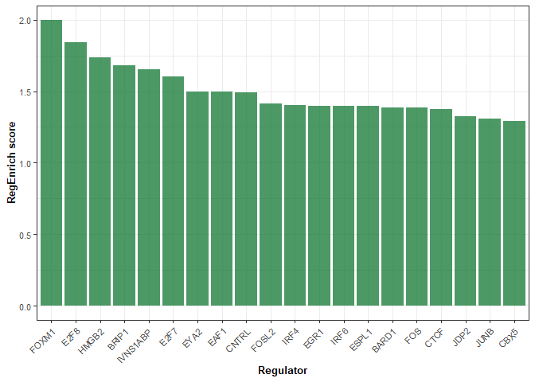<!-- -->

``` r
#Export as vector graphic
graph2svg(Figure_3B_RegEnrichScore_HLF, file = "Figure_3B_RegEnrichScore_HLF", height = 2.5, width = 4.5)
```

    ## Exported graph as Figure_3B_RegEnrichScore_HLF.svg

``` r
Figure_3B_RegEnrichScore_HLF_LPS <- ggplot(LPS_HLF_score_TF_plot, aes(x = reorder(reg, -score), y=score, fill = (reg))) +  
         geom_bar(stat="identity", position="dodge",  alpha = 0.75) + scale_fill_manual(values = rep(c("#6699CC"), time = 20 ), labels = c("HLF_LPS")) + 
         labs(y = "RegEnrich score", x = "Regulator") + theme_bw() + theme(axis.text.y=element_text(size=8), 
                                                                           axis.text.x=element_text(size=8, angle = 45, hjust = 1.1), 
                                                                           axis.title = element_text(size = 12, face = "bold"), 
                                                                           legend.title = element_blank(),
                                                                           legend.text = element_text(size = 12), legend.position = "none")


print(Figure_3B_RegEnrichScore_HLF_LPS)
```

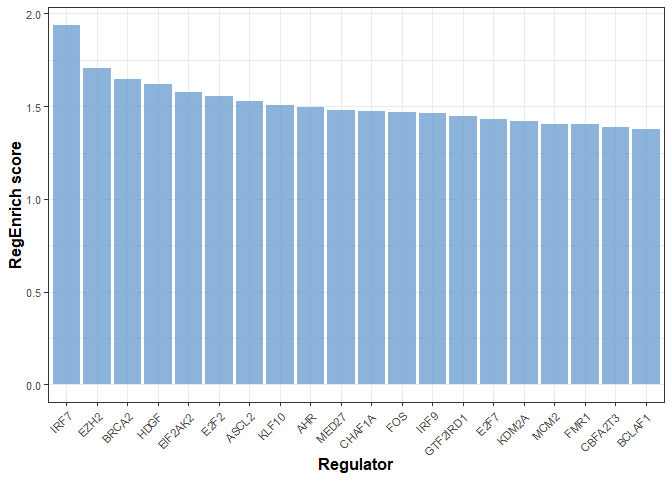<!-- -->

``` r
#Export as vector graphic
graph2svg(Figure_3B_RegEnrichScore_HLF_LPS, file = "Figure_3b_RegEnrichScore_HLF_LPS", height = 2.53, width = 5)
```

    ## Exported graph as Figure_3b_RegEnrichScore_HLF_LPS.svg

## Heatmap of regulator norm. expression values (Figure 3A)

``` r
#identify top 25 regulators for each condition
LPS_score_TF_hm <- results_score(object_LPS) %>% as.data.frame() %>% mutate(type = "LPS") %>% head(25)
HLF_score_TF_hm <- results_score(object_HLF) %>% as.data.frame() %>% mutate(type = "HLF") %>% head(25) 
HLF_LPS_score_TF_hm <- results_score(object_LPS_HLF) %>% as.data.frame() %>% mutate(type = "HLF_LPS") %>% head(25)

#vector to obtain input genes for respective regulators
TF_heatmap <- rbind(LPS_score_TF_hm, HLF_score_TF_hm)
TF_heatmap <- rbind(TF_heatmap, HLF_LPS_score_TF_hm)
TF_heatmap <- TF_heatmap %>% group_by(reg) %>% slice(1L) %>% ungroup()
TF_heatmap_SYMBOLS <- c(TF_heatmap$reg)

#get expression data into dataframe for all samples
d_2 <- Biobase::exprs(palmieri_final)
PROBEID <- rownames(d_2)
rownames(d_2) <- NULL
d_2 <- cbind(PROBEID,d_2) 
d_2 <- as.data.frame(d_2)
palmieri_final_SYMBOL <- palmieri_final@featureData@data %>% select(PROBEID, SYMBOL)
rownames(palmieri_final_SYMBOL) <- NULL
palmieri_final_SYMBOL <- do.call("rbind", list(palmieri_final_SYMBOL))
d_2 <- d_2 %>% merge(palmieri_final_SYMBOL)

#export all sign. diff. genes (adj.p.value < 0.05, log2FC > 0.58/< -0.58) for all samples
sign_genes_exp <- d_2

#get significant gene Symbol vector
DE_Symbols <- rbind(DE_comp1, DE_comp2)
DE_Symbols <- rbind(DE_Symbols, DE_comp3) %>% select(SYMBOL)
DE_Symbols <- DE_Symbols %>%  group_by(SYMBOL) %>% slice(1L) %>% ungroup() 
vector_DE_Symbols <- c(DE_Symbols$SYMBOL)

sign_genes_exp <- subset(sign_genes_exp, (sign_genes_exp$SYMBOL %in% vector_DE_Symbols))
sign_genes_exp <- sign_genes_exp %>% select(-PROBEID)
sign_genes_exp <- sign_genes_exp %>% select(SYMBOL, everything())

xyxy <- c("human HGNC gene name", "MCSF_Proband_A", "MCSF_Proband_B", "MCSF_Proband_C", "MCSF_Proband_D",
          "HLF_Proband_A","HLF_Proband_B", "HLF_Proband_C", "HLF_Proband_D",
          "MCSF_LPS_Proband_A", "MCSF_LPS_Proband_B", "MCSF_LPS_Proband_C", "MCSF_LPS_Proband_D",
          "HLF_LPS_Proband_A", "HLF_LPS_Proband_B", "HLF_LPS_Proband_C", "HLF_LPS_Proband_D"
          )
colnames(sign_genes_exp) <- xyxy

write.xlsx(sign_genes_exp, 'Stand_Log2_Expression_ALL_DEG.xlsx')


#susbet dataframe with vector of regulators
TF_heatmap <- subset(d_2, (d_2$SYMBOL %in% TF_heatmap_SYMBOLS))
TF_heatmap <- TF_heatmap[!duplicated(TF_heatmap$SYMBOL), ]
TF_heatmap <- TF_heatmap %>% select(-PROBEID)
rownames(TF_heatmap) <- c(TF_heatmap$SYMBOL)

#data wrangling (getting annotations into heatmap dataframe)
Condition_vec <- c("M-CSF", "M-CSF", "M-CSF", "M-CSF", "HLF", "HLF", "HLF", "HLF", "LPS", "LPS", "LPS", "LPS", "HLF_LPS", "HLF_LPS", "HLF_LPS", "HLF_LPS", "") %>% as.data.frame() %>% t() %>% as.data.frame()
x <- colnames(TF_heatmap)
colnames(Condition_vec) <- x
TF_heatmap <- rbind(TF_heatmap, Condition_vec) %>% t() %>% as.data.frame() %>% rename("Condition" = ".")

#Heatmap
#define metadata
TF_heatmap_metadaten <- TF_heatmap %>%  as.data.frame() %>%  mutate_at(c(67), as.factor) %>% select(Condition) %>% t() %>% as.data.frame() %>% select(-SYMBOL) %>% t() %>% as.data.frame()

#wrangling
TF_heatmap <- TF_heatmap %>% mutate_at(c(1:66), as.numeric) %>% mutate_at(c(67), as.factor) 

#get annotation
col_an = HeatmapAnnotation(Stimulation = TF_heatmap_metadaten$Condition,
                           col = list(Stimulation = c("M-CSF" = "#DEC08B", "LPS" = "#CC6677", "HLF" = "#117733", "HLF_LPS" = "#6699CC")))

#scale heatmap
TF_heatmap_scale <- TF_heatmap[1:66] %>% as.data.frame() %>% t() %>% as.data.frame() %>% select(-SYMBOL) %>% t()

TF_heatmap_scale <- scale(TF_heatmap_scale) %>% t() %>% as.matrix()

#define row annotation
row_ha = rowAnnotation(Expression = anno_barplot(runif(66)), annotation_name_gp= gpar(fontsize = 20))

#costum palette
my_palette <-  colorRampPalette(c("#0765A0", "#FFF1E4","#C61700"))(100)

#Create heatmap
Figure3A<- Heatmap(TF_heatmap_scale,
                     clustering_distance_columns = "euclidean", clustering_distance_rows = "euclidean",
                     clustering_method_columns = "complete", clustering_method_rows = "complete",  column_dend_height = unit(3, "cm"), col = my_palette, column_km = 3, column_gap =unit(3, "mm"), top_annotation =col_an, column_title_gp = gpar(fontsize = 10), row_names_gp = gpar(fontsize = 6), show_column_names = FALSE)

print(Figure3A)
```

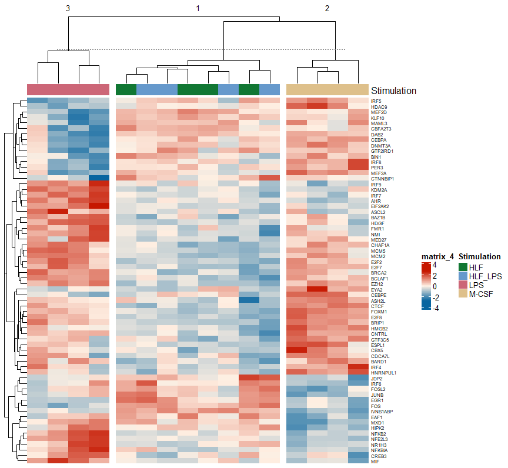<!-- -->

``` r
#Export as vector graphic
graph2svg(Figure3A, file = "Figure_3A", height = 8.3, width = 4.6)
```

    ## Exported graph as Figure_3A.svg

### Sankey plot data preparation

``` r
#getting df/vector of enriched regulators
HLF_score_TF_bar <- results_score(object_HLF) %>% as.data.frame() %>% mutate(type = "HLF")

HLF_score_TFbar_names <- c(HLF_score_TF_bar$reg)

#getting top network
TF_HLF_genes_bar  <- object_HLF@topNetwork@elementset

#Subsetting top network for relevant regulators (retrieve connections)
TF_HLF_genes_bar <- subset(TF_HLF_genes_bar, (TF_HLF_genes_bar$set %in% HLF_score_TFbar_names))

#wrangling
TF_HLF_genes_bar <-TF_HLF_genes_bar  %>% as.data.frame() %>% select(-weight)
TF_HLF_genes_bar<- TF_HLF_genes_bar %>% rename("gene"= "element")

#create big adjacency matrix: Combine previously generated binary matrix of pathway and genes for HLF (GoPlot_2) with regulator information
circ_bp_HLF <- merge(GoPlot_2, TF_HLF_genes_bar, by = "gene")


#manual computation (how often is each TF-factor prevalent in regulating genes of a specific pathway?)
# make TF name instead of 1

pathways <- circ_bp_HLF %>%
  select(-gene, -logFC, -set) %>%
  colnames()


for(i in pathways){
  circ_bp_HLF[[i]] <- ifelse(circ_bp_HLF[[i]] == 1, circ_bp_HLF$set, 0)
}

#make empty df, store n-times: colnames  =pathway (for TFs)
circ_df <- circ_bp_HLF %>%
  select(all_of(pathways)) %>%
  slice(1:5)

for(i in pathways){
  circ_df[[i]] <- NA
}

penalty <- TF_HLF_genes_bar %>% select(set) %>% group_by(set) %>% mutate(count = length(set)) %>% distinct()

for(i in pathways){
transfer <- circ_bp_HLF %>%
dplyr::count(circ_bp_HLF[[i]]) %>%
arrange(desc(n)) %>%
slice(1:6)
transfer <- transfer[-1,]
colnames(transfer) <- c(i, "n")
circ_df[[i]] <- transfer[[i]]
}

#sink()
circ_df <- circ_df %>% select(`Cell Cycle`, `Cell Cycle, Mitotic`, "M Phase", `Cell Cycle Checkpoints`, `Condensation of Prophase Chromosomes`, `Deposition of new CENPA-containing nucleosomes at the centromere`, `DNA Replication`,
                              `Interleukin-4 and Interleukin-13 signaling`, "Syndecan interactions")
circ_df <- t(circ_df) %>% as.data.frame()
circ_df$pathway = rownames(circ_df)
circ_df <- pivot_longer(circ_df, cols = 1:5, names_to ="TF",
                        values_to = "TFs") %>% select(-TF)


#add additional information into dataframe (eg. RegEnrichScore)
circ_df_names <- circ_df$TFs %>% unique()

circ_df_score <- subset(HLF_score_TF, (HLF_score_TF$reg %in% circ_df_names)) %>% select(reg, score)
circ_df_score <- circ_df_score %>% rename("TFs" = "reg")
circ_df <- left_join(circ_df,circ_df_score, by ="TFs" ) %>% as.data.frame()
circ_df <- circ_df %>% arrange(pathway, score)

#wrangling
circ_df <- circ_df %>%
  mutate("sign" = case_when(
    circ_df$score < 0 ~ "negative",
    circ_df$score > 0 ~ "positive"
  ))
circ_df <- circ_df %>%  mutate_at(c(1,4), as.factor)
```

## Sankey plot of regulators and their functions (Figure 3C)

``` r
circ_df_sankey <- circ_df %>% na.omit()
circ_df_sankey <- circ_df_sankey %>% rename("element" = "pathway")
circ_df_sankey <- circ_df_sankey %>% rename("set" = "TFs")
circ_df_sankey <- circ_df_sankey %>% select(set, element, score) %>% arrange(desc(score))

nodes_Sankey <- data.frame(
  name=c(as.character(circ_df_sankey$set), 
         as.character(circ_df_sankey$element)) %>% unique())

circ_df_sankey$IDset <- match(circ_df_sankey$set, nodes_Sankey$name)-1 
circ_df_sankey$IDelement <- match(circ_df_sankey$element, nodes_Sankey$name)-1

circ_df_sankey$group <- as.character(circ_df_sankey$element)
circ_df_sankey <- circ_df_sankey %>%  dplyr::mutate(group = ifelse(group == "Cell Cycle", "b", group),
                                                    group = ifelse(group == "Cell Cycle, Mitotic", "c", group),
                                                    group = ifelse(group == "Cell Cycle Checkpoints", "d", group))
circ_df_sankey$group <- as.factor(circ_df_sankey$group)


c(circ_df_sankey$element)

nodes_Sankey$group <- as.factor(c("a", "a", "a", "a", "a", "a", "a", "a", "a", "a", "a", "a", "b", "c", "Condensation of Prophase Chromosomes", "Deposition of new CENPA-containing nucleosomes at the centromere",  "DNA Replication", "M Phase","Syndecan interactions",
                                  "Interleukin-4 and Interleukin-13 signaling", "d"))

x <- circ_df_sankey$set %>% unique() %>% c()

#optional: color vector!
#my_color <- 'd3.scaleOrdinal() .domain(["a", "b", "c", "Condensation of Prophase Chromosomes", "Deposition of new CENPA-containing nucleosomes at the centromere",  "DNA Replication", "M Phase",
#"Syndecan interactions","Interleukin-4 and Interleukin-13 signaling", "d"]) 
#.range(["#9E0142","#D53E4F","#FDAE61","#FEE08B","#E6F598","#ABDDA4","#66C2A5","#3288BD","#9E0143"])'

a <- sankeyNetwork(Links = circ_df_sankey, Nodes = nodes_Sankey,
                   fontFamily = "Arial", Source = "IDset", Target = "IDelement",  margin = list(left = 120, right = 60), Value = 'score', NodeID = "name", LinkGroup= "group", sinksRight = TRUE, nodeWidth =30, fontSize = 12)

Figure_3C<- onRender(
  a,
  '
  function(el, x) {
    d3.selectAll(".node text").attr("text-anchor", "begin").attr("x").attr("font-weight", "bold");
  }
  ')


print(Figure_3C)
```

# Analysis of macrophage interactome

## Import of genes from Innate DB (File in GitHub repository)

``` r
immune_DB_genes <- rio::import("C:/Users/Michi/Documents/Microarray Analysis/data/InnateDB_15.02.23.xls")
immune_DB_genes <- immune_DB_genes %>% filter(Species == "9606") %>% rename("SYMBOL" = "Gene Symbol") %>% select(SYMBOL, `InnateDB Gene ID`)
immune_DB_genes_sliced <- immune_DB_genes %>% group_by(SYMBOL) %>% slice(1L) %>% ungroup()

#vector of all gene Symbols
immune_DB_genes_sliced_vector <- c(immune_DB_genes_sliced$SYMBOL)

#df preparation of norm. expression values and data wrangling
Comp_palmieri_2 <- tidyr::pivot_longer(d_2, cols=2:17, names_to = "Experiment", values_to = "Expression")
Comp_palmieri_2 <- Comp_palmieri_2 %>% mutate(Treatment = case_when(grepl("HLF_LPS", Experiment) ~ "HLF_LPS", grepl("MOCK", Experiment) ~"MOCK", grepl("HLF", Experiment)~"HLF", grepl("LPS", Experiment)~"LPS"))
Comp_palmieri_2 <- Comp_palmieri_2 %>% mutate(Proband = case_when(grepl("11", Experiment) ~ "1", grepl("12", Experiment) ~ "2", grepl("13", Experiment) ~ "3", grepl("14", Experiment) ~ "4"))

Comp_palmieri_2$Treatment <- as.factor(Comp_palmieri_2$Treatment)
Comp_palmieri_2$Proband <- as.factor(Comp_palmieri_2$Proband)
Comp_palmieri_2$Expression <- as.numeric(Comp_palmieri_2$Expression)
Comp_palmieri_2$Experiment <- as.factor(Comp_palmieri_2$Experiment)
```

## Load cytokine data from ImmPort (File in GitHub repository)

``` r
cytokine_DB_genes <- rio::import("C:/Users/Michi/Documents/Microarray Analysis/data/Cytokine registry_16.03.23.xls")
cytokine_DB_vector <- c(cytokine_DB_genes$SYMBOL)

#exclude some molecules that popped up erroneously in subsequent analyses
cytokine_DB_vector <- cytokine_DB_vector[! cytokine_DB_vector %in% c("IL21R", "IL7R", "CSF2RB", "IL12RB2", 
                                                                     "TNFRSF10D", "IL1R1", "TGFBR1", "IL6R", 
                                                                     "CSF3R", "CD40", "TNFRSF4", "IFNGR2", "TNFRSF9", 
                                                                     "IFNAR1", "TNFRSF18")]

#Subset dataframe with norm. expression for cytokine genes (for all genes = Comp_palmieri_2)
cytokine_genes <- subset(Comp_palmieri_2, (Comp_palmieri_2$SYMBOL %in% cytokine_DB_vector)) %>% select(-SYMBOL)

#select only significant genes (Comp_palmieri only includes norm. expression values of significant genes)
cytokine_genes_PROBEID_vector <- c(cytokine_genes$PROBEID)
cytokine_genes_sign <- subset(Comp_palmieri, (Comp_palmieri$PROBEID %in% cytokine_genes_PROBEID_vector))

#data wrangling
cytokine_genes_sign <- cytokine_genes_sign %>% mutate(Treatment = case_when(grepl("HLF_LPS", Experiment) ~ "HLF_LPS", grepl("MOCK", Experiment) ~"MOCK", grepl("HLF", Experiment)~"HLF", grepl("LPS", Experiment)~"LPS"))
cytokine_genes_sign <- cytokine_genes_sign %>% mutate(Proband = case_when(grepl("11", Experiment) ~ "1", grepl("12", Experiment) ~ "2", grepl("13", Experiment) ~ "3", grepl("14", Experiment) ~ "4"))

cytokine_genes_sign$Treatment <- as.factor(cytokine_genes_sign$Treatment)
cytokine_genes_sign$Proband <- as.factor(cytokine_genes_sign$Proband)
cytokine_genes_sign$Expression <- as.numeric(cytokine_genes_sign$Expression)
cytokine_genes_sign$Experiment <- as.factor(cytokine_genes_sign$Experiment)

#get vector of all sign. cytokine genes PROBEIDs
cytokine_genes_sign_vector <- c(cytokine_genes_sign$PROBEID)
```

## Heatmap of cytokines (Figure 4C)

``` r
cytokine_genes_sign_matrix <- cytokine_genes_sign %>% pivot_wider(names_from = PROBEID, values_from = Expression)
cytokine_genes_sign_matrix <- cytokine_genes_sign_matrix %>% mutate_at(c(4:34), as.numeric)


cytokine_genes_sign_matrix_scaled <- scale(cytokine_genes_sign_matrix[4:34])
cytokine_genes_sign_matrix_scaled<- t(cytokine_genes_sign_matrix_scaled)


cytokine_genes_matrix_sign_metadaten <- cytokine_genes_sign_matrix %>% select(Experiment, Treatment, Proband)

#get row annotation
vector <- rownames(cytokine_genes_sign_matrix_scaled) %>% as.data.frame() %>% rename("PROBEID" = ".")
vector_anno <- d_2 %>% select(SYMBOL, PROBEID)
vector <- vector %>% left_join(vector_anno, by = "PROBEID")
vector <- vector %>% select(SYMBOL)
vector_2 <- c(vector$SYMBOL)
row_ha = rowAnnotation(foo2 = anno_text(vector_2, gp = gpar(fontsize = 8)))

#column annotation
col_an = HeatmapAnnotation(Stimulation = cytokine_genes_matrix_sign_metadaten$Treatment,
                           col = list(Stimulation = c("MOCK" = "#DEC08B", "LPS" = "#CC6677", "HLF" = "#117733", "HLF_LPS" = "#6699CC")))

Figure_4C <- Heatmap(cytokine_genes_sign_matrix_scaled, name = "logFC", show_row_names = FALSE, show_row_dend = FALSE,
        clustering_distance_columns = "euclidean", clustering_distance_rows = "euclidean", right_annotation = row_ha,
        clustering_method_columns = "complete", clustering_method_rows = "complete", col = my_palette,
        column_names_side = "top",  column_dend_side = "top", column_dend_height = unit(3, "cm"), column_km = 3, column_gap =unit(3, "mm"),   column_title_gp = gpar(fontsize = 10),column_title = c("LPS", "Control", "LPS&HLF or HLF"),  
        top_annotation = col_an)

print(Figure_4C)
```

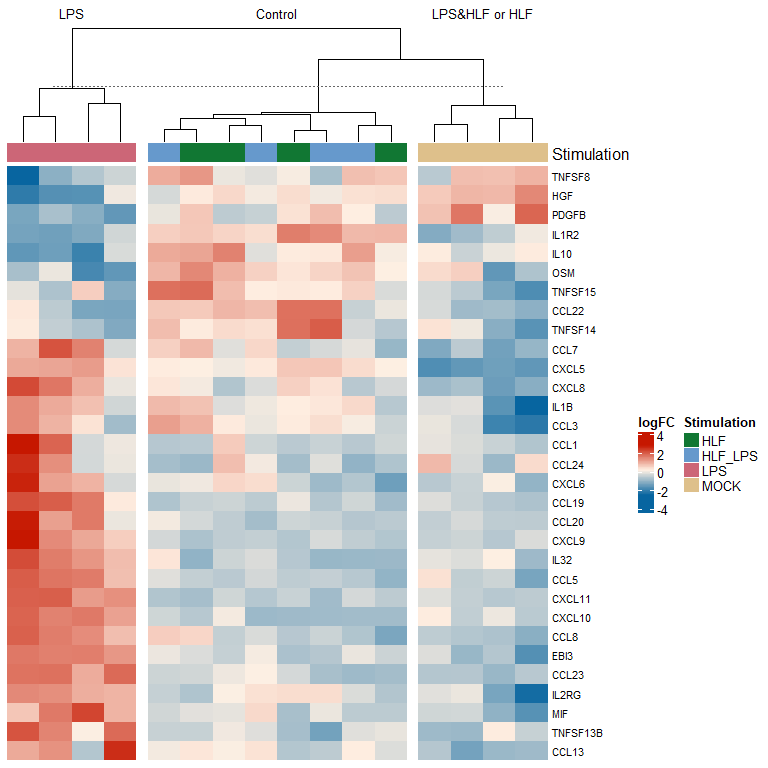<!-- -->

``` r
#Export as vector graphic
graph2svg(Figure_4C, file = "Figure_4C", width = 4.9, height = 4.8)
```

    ## Exported graph as Figure_4C.svg

## Import of protein localisation annotations from Human Protein Atlas

``` r
#get annotations for membrane proteins from human Protein Atlas
membrane_protein_DB <- rio::import("C:/Users/Michi/Documents/Microarray Analysis/data/human_protein_atlas_16.03.23.xlsx") %>% na.omit() %>% filter(Evidence == "Evidence at protein level")
membrane_protein_DB_Symbols_vector <- c(membrane_protein_DB$SYMBOL)
membrane_protein_DB_Symbols_vector <- membrane_protein_DB_Symbols_vector[! membrane_protein_DB_Symbols_vector %in% c("EPS8", "VASP", "SOCS3", "PIK3AP1", "JAK3", "OAS3", "LYN")]

#retrieve all immunological relevant membrane proteins from our data
macrophages_membrane_proteins <- subset(Comp_palmieri_2, (Comp_palmieri_2$SYMBOL %in% membrane_protein_DB_Symbols_vector))
macrophages_membrane_proteins <- subset(macrophages_membrane_proteins, (macrophages_membrane_proteins$SYMBOL %in% immune_DB_genes_sliced_vector))

#get vector
macrophages_membrane_proteins_PROBEID_vector <- c(macrophages_membrane_proteins$PROBEID)

#get the same only for significantly expressed genes
macrophages_membrane_proteins_sign <- subset(Comp_palmieri, (Comp_palmieri$PROBEID %in% macrophages_membrane_proteins_PROBEID_vector))

#data wrangling
macrophages_membrane_proteins_sign <- macrophages_membrane_proteins_sign %>% mutate(Treatment = case_when(grepl("HLF_LPS", Experiment) ~ "HLF_LPS", grepl("MOCK", Experiment) ~"MOCK", grepl("HLF", Experiment)~"HLF", grepl("LPS", Experiment)~"LPS"))
macrophages_membrane_proteins_sign <- macrophages_membrane_proteins_sign %>% mutate(Proband = case_when(grepl("11", Experiment) ~ "1", grepl("12", Experiment) ~ "2", grepl("13", Experiment) ~ "3", grepl("14", Experiment) ~ "4"))

macrophages_membrane_proteins_sign$Treatment <- as.factor(macrophages_membrane_proteins_sign$Treatment)
macrophages_membrane_proteins_sign$Proband <- as.factor(macrophages_membrane_proteins_sign$Proband)
macrophages_membrane_proteins_sign$Expression <- as.numeric(macrophages_membrane_proteins_sign$Expression)
macrophages_membrane_proteins_sign$Experiment <- as.factor(macrophages_membrane_proteins_sign$Experiment)

#retrieve vector
macrophages_membrane_proteins_sign_PROBEID_vector <- c(macrophages_membrane_proteins_sign$PROBEID)
```

## Heatmap of all immunologically relevant membrane proteins (Figure 4B)

``` r
macrophages_membrane_proteins_sign_matrix <- macrophages_membrane_proteins_sign %>% pivot_wider(names_from = PROBEID, values_from = Expression)

macrophages_membrane_proteins_sign_matrix <- macrophages_membrane_proteins_sign_matrix %>% mutate_at(c(4:25), as.numeric)

macrophages_membrane_proteins_sign_matrix_scaled  <- scale(macrophages_membrane_proteins_sign_matrix[4:25])
macrophages_membrane_proteins_sign_matrix_scaled<- t(macrophages_membrane_proteins_sign_matrix_scaled)

#metadata
macrophages_membrane_proteins_scaled_metadaten <- macrophages_membrane_proteins_sign_matrix %>% select(Experiment, Treatment, Proband)

#column annotation
col_an = HeatmapAnnotation(Stimulation = macrophages_membrane_proteins_scaled_metadaten$Treatment,
                           col = list(Stimulation = c("MOCK" = "#DEC08B", "LPS" = "#CC6677", "HLF" = "#117733", "HLF_LPS" = "#6699CC")))

#row annotation
vector <- rownames(macrophages_membrane_proteins_sign_matrix_scaled) %>% as.data.frame() %>% rename("PROBEID" = ".")
vector_anno <- d_2 %>% select(SYMBOL, PROBEID)
vector <- vector %>% left_join(vector_anno, by = "PROBEID")
vector <- vector %>% select(SYMBOL)
vector_2 <- c(vector$SYMBOL)
row_ha = rowAnnotation(foo2 = anno_text(vector_2, gp = gpar(fontsize = 8)))

#print figure 4B
Figure_4B <- Heatmap(macrophages_membrane_proteins_sign_matrix_scaled, name = "logFC", show_row_names = FALSE, show_row_dend = FALSE, 
        clustering_distance_columns = "euclidean", clustering_distance_rows = "euclidean",right_annotation = row_ha, col = my_palette,
        clustering_method_columns = "complete", clustering_method_rows = "complete",
        column_names_side = "top",  column_dend_side = "top", column_dend_height = unit(3, "cm"),  column_km = 3, column_gap =unit(3, "mm"),   column_title_gp = gpar(fontsize = 10),column_title = c("LPS", "Control", "LPS&HLF or HLF"),
        top_annotation = col_an)

print(Figure_4B)
```

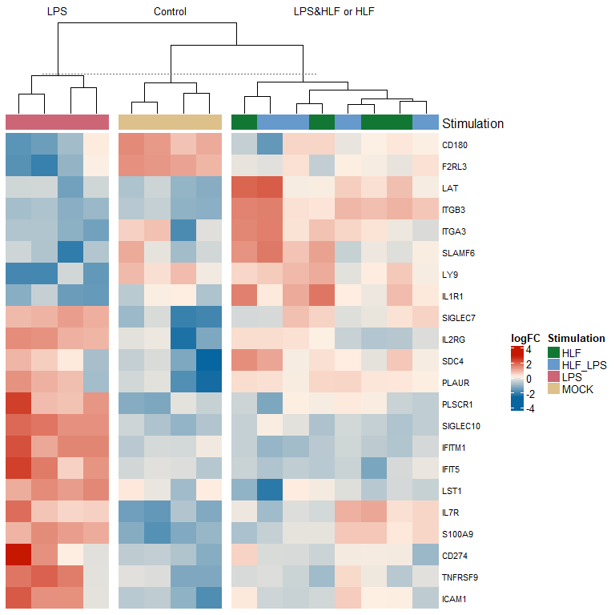<!-- -->

``` r
graph2svg(Figure_4B, file = "Figure_4B", width = 4.85, height = 4.35)
```

    ## Exported graph as Figure_4B.svg

### Cytokines and membrane proteins per enriched immunologically relevant reactome pathway

``` r
#retrieve all genes from the previously computed adjacency matrix with a log2FC > 1 for each condition and filter those that are irrelevant -> row sum = 0
GoPlot_dotplot_LPS1 <- GoPlot_1 %>% select(gene:logFC)
GoPlot_dotplot_LPS1 <- filter(GoPlot_dotplot_LPS1,rowSums(GoPlot_dotplot_LPS1[,2:22])!= 0)
GoPlot_dotplot_LPS1 <- GoPlot_dotplot_LPS1 %>% filter(logFC >1 | logFC < 1)
GoPlot_dotplot_LPS1 <- GoPlot_dotplot_LPS1 %>%  column_to_rownames(var = "gene")


GoPlot_dotplot_HLF1 <- GoPlot_2 %>% select(gene:logFC)
GoPlot_dotplot_HLF1 <- filter(GoPlot_dotplot_HLF1,rowSums(GoPlot_dotplot_HLF1[,2:151])!= 0)
GoPlot_dotplot_HLF1 <- GoPlot_dotplot_HLF1 %>% filter(logFC > 1 | logFC < - 1)
GoPlot_dotplot_HLF1 <- GoPlot_dotplot_HLF1 %>%  column_to_rownames(var = "gene")

GoPlot_dotplot_HLF_LPS1 <- GoPlot_3 %>% select(gene:logFC)
GoPlot_dotplot_HLF_LPS1 <- filter(GoPlot_dotplot_HLF_LPS1,rowSums(GoPlot_dotplot_HLF_LPS1[,2:112])!= 0)
GoPlot_dotplot_HLF_LPS1 <- GoPlot_dotplot_HLF_LPS1 %>% filter(logFC > 1 | logFC < - 1)
GoPlot_dotplot_HLF_LPS1 <- GoPlot_dotplot_HLF_LPS1 %>%  column_to_rownames(var = "gene")

#get only cytokines with logFc > 1 for enriched pathways for each condition
#LPS-MOCK
Cytokines_reactome_LPS <- GoPlot_dotplot_LPS1 %>% left_join(GoPlot_1_genes, by = "logFC")
Cytokines_reactome_LPS$type <- c("cytokine")
Cytokines_reactome_LPS$Condition <- c("LPS")
rownames(Cytokines_reactome_LPS) <- Cytokines_reactome_LPS$gene
Cytokines_reactome_LPS <- subset(Cytokines_reactome_LPS, (Cytokines_reactome_LPS$gene %in% cytokine_DB_vector))


#HLF-MOCK
Cytokines_reactome_HLF <- GoPlot_dotplot_HLF1 %>% left_join(GoPlot_2_genes, by = "logFC")
Cytokines_reactome_HLF$type <- c("cytokine")
Cytokines_reactome_HLF$Condition <- c("HLF")
rownames(Cytokines_reactome_HLF) <- Cytokines_reactome_HLF$gene
Cytokines_reactome_HLF <- subset(Cytokines_reactome_HLF, (Cytokines_reactome_HLF$gene %in% cytokine_DB_vector))


#LPS_HLF - LPS
Cytokines_reactome_HLF_LPS <- GoPlot_dotplot_HLF_LPS1 %>% left_join(GoPlot_3_genes, by = "logFC")
Cytokines_reactome_HLF_LPS$type <- c("cytokine")
Cytokines_reactome_HLF_LPS$Condition <- c("HLF_LPS")
rownames(Cytokines_reactome_HLF_LPS) <- Cytokines_reactome_HLF_LPS$gene
Cytokines_reactome_HLF_LPS <- subset(Cytokines_reactome_HLF_LPS, (Cytokines_reactome_HLF_LPS$gene %in% cytokine_DB_vector))

#get only membrane proteins with logFc > 1 for enriched pathways for each condition

#LPS-MOCK
Membrane_reactome_LPS <- GoPlot_dotplot_LPS1 %>% left_join(GoPlot_1_genes, by = "logFC")
Membrane_reactome_LPS$type <- c("membrane")
Membrane_reactome_LPS$Condition <- c("LPS")
rownames(Membrane_reactome_LPS) <- Membrane_reactome_LPS$gene
Membrane_reactome_LPS <- subset(Membrane_reactome_LPS, (Membrane_reactome_LPS$gene %in% membrane_protein_DB_Symbols_vector))


#HLF-MOCK
Membrane_reactome_HLF <- GoPlot_dotplot_HLF1 %>% left_join(GoPlot_2_genes, by = "logFC")
Membrane_reactome_HLF$type <- c("membrane")
Membrane_reactome_HLF$Condition <- c("HLF")
rownames(Membrane_reactome_HLF) <- Membrane_reactome_HLF$gene
Membrane_reactome_HLF <- subset(Membrane_reactome_HLF, (Membrane_reactome_HLF$gene %in% membrane_protein_DB_Symbols_vector))


#LPS_HLF - LPS
Membrane_reactome_HLF_LPS <- GoPlot_dotplot_HLF_LPS1 %>% left_join(GoPlot_3_genes, by = "logFC")
Membrane_reactome_HLF_LPS$type <- c("membrane")
Membrane_reactome_HLF_LPS$Condition <- c("HLF_LPS")
rownames(Membrane_reactome_HLF_LPS) <- Membrane_reactome_HLF_LPS$gene
Membrane_reactome_HLF_LPS <- subset(Membrane_reactome_HLF_LPS, (Membrane_reactome_HLF_LPS$gene %in% membrane_protein_DB_Symbols_vector))


#Join the dataframes into a master-table
full <- full_join(Cytokines_reactome_LPS, Cytokines_reactome_HLF)
full <- full_join(full, Cytokines_reactome_HLF_LPS)
full <- full_join(full, Membrane_reactome_LPS)
full <- full_join(full, Membrane_reactome_HLF)
full <- full_join(full, Membrane_reactome_HLF_LPS)

full[is.na(full)] <- 0
full <- full %>%  select(-logFC)

#Manually looked through all enriched pathways for all 3 conditions and build a vector with only those that are significant to immunity

pathways_include <- c("Cytokine Signaling in Immune system", "Interferon Signaling", "Interferon alpha/beta signaling","Immunoregulatory interactions between a Lymphoid and a non-Lymphoid cell", 
                      "Interleukin-10 signaling", "Interferon gamma signaling", "Chemokine receptors bind chemokines", "Interleukin-4 and Interleukin-13 signaling", "Signaling by Interleukins", "Adaptive Immune System", 
                      "Neutrophil degranulation", "DDX58/IFIH1-mediated induction of interferon-alpha/beta","Defective pyroptosis", "Transcriptional regulation of granulopoiesis", "Interleukin-7 signaling", "MHC class II antigen presentation", 
                      "Antiviral mechanism by IFN-stimulated genes")

#create df for heatmap with loops
full <- full %>%select(gene:Condition, all_of(pathways_include))

for(i in 4:length(full)){
  full[[i]] <- ifelse(full[[i]] == 1, i, full[[i]])
}
                                  
genes <- data.frame(SYMBOL = full$gene) %>% unique()


looppp <- full[,c(1:4)]
colnames(looppp)[4] <- "pathway"
looppp <- looppp[1,]
looppp[1,]  <- NA

gucki.name <- colnames(full[,4:20])

gucki.df <- data.frame(Pathway = gucki.name, pathway = c(4:20))

gene_expression <- genes %>% left_join(d_2, by = "SYMBOL") %>%
  group_by(SYMBOL) %>%
  sample_n(1) %>%
  ungroup() %>% 
  select(-c(PROBEID)) %>% mutate_at(c(2:17), as.numeric)


for(i in gucki.name){
  michi <- cbind(full[, c(1:3)], pathway = full[[i]])
  michi <- subset(michi, pathway != 0)
  looppp <- rbind(looppp, michi)
}

pathway.htmp <- looppp[-1,]
pathway.htmp <- pathway.htmp %>% rename(SYMBOL = gene) %>% left_join(gene_expression, by = "SYMBOL") 
pathway.htmp <- pathway.htmp %>% arrange(pathway, type, Condition) %>% mutate_at(c(5:20), as.numeric) %>% mutate_at(c(2:3), as.factor) %>% mutate_at(c(4), as.character) #%>% filter(pathway == 9 | pathway == 11 | pathway == 4 | pathway == 6)

gucki.df <- gucki.df %>% mutate_at(c(2), as.character)
pathway.htmp <- pathway.htmp %>% left_join(gucki.df, by = "pathway") %>% select(-pathway)

#exclude pathways with low number of subsetted genes
pathway.htmp <- pathway.htmp %>% filter(!Pathway %in% c('Transcriptional regulation of granulopoiesis', 'Antiviral mechanism by IFN-stimulated genes', "DDX58/IFIH1-mediated induction of interferon-alpha/beta"))
```

## Heatmap of membrane protein and cytokine genes involved in immunologically relevant pathways (Figure 4A)

``` r
pathway.htmp_scale <- pathway.htmp[4:19] %>% as.data.frame() %>% t()
pathway.htmp_scale <- scale(pathway.htmp_scale) %>% t()

#metadata
pathway.htmp_metadaten <- pathway.htmp %>% select(type, Condition, Pathway)

text_list <- list(unique(pathway.htmp_metadaten$Pathway))

Figure_4A <- Heatmap(pathway.htmp_scale,
                     row_split = pathway.htmp_metadaten$Pathway, cluster_row_slices = FALSE , column_km = 3, column_gap =unit(3, "mm"), row_gap =unit(3, "mm"), col = my_palette, 
        right_annotation = rowAnnotation(Pathway = anno_block(gp = gpar(fill = c("#2400D9FF", "#191DF7FF", "#2957FFFF", "#3D87FFFF", 
                                                                                 "#57B0FFFF", "#75D3FFFF", "#99EBFFFF", "#BDF9FFFF",
                                                                                 "#FFF2BDFF", "#FFD699FF", "#FFAC75FF", "#FF7857FF", 
                                                                                 "#FF3D3DFF", "#F72836FF", "#D91630FF", "#A60021FF")))),
        width = max_text_width(unlist(text_list)))


print(Figure_4A)
```

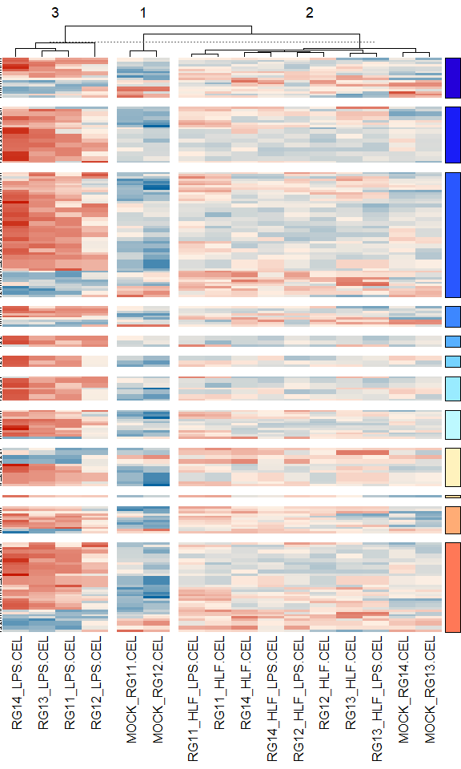<!-- -->

``` r
#Export as vector graphic - column annotation and row annotation was assigned manually in a vector graphics program and checked thrice
graph2svg(Figure_4A, file = "Figure_4A", height = 9 , width = 10)
```

    ## Exported graph as Figure_4A.svg

### Boxplot and ANOVA + post hoc tukey for interesting proteins/cytokines

``` r
#manually compute data-frame of targets + conditions + samples + norm. expression values of selected genes
targets <- c( "SIGLEC7", "TLR4", "TNFSF15", "IL10", "CCL22")

target_boxplot <-  subset(d_2, (d_2$SYMBOL %in% targets))
target_boxplot <- target_boxplot %>%
  group_by(SYMBOL) %>%
  sample_n(1) %>% select(-PROBEID)
target_boxplot <- t(target_boxplot) %>% as.data.frame()


a <- c("MOCK", "MOCK", "MOCK","MOCK", "HLF", "HLF", "HLF", "HLF", "LPS", "LPS", "LPS", "LPS", "HLF_LPS", "HLF_LPS", "HLF_LPS","HLF_LPS", "SYMBOL" )
target_boxplot$condition <- a 
target_boxplot <- t(target_boxplot) %>% as.data.frame()
rownames(target_boxplot) <- c(target_boxplot$SYMBOL)
target_boxplot <- target_boxplot %>% select(-SYMBOL) 
target_boxplot <- t(target_boxplot) %>% as.data.frame()

#wrangling
target_boxplot <- target_boxplot %>%  pivot_longer(-SYMBOL, names_to="gene", values_to ="expression")
target_boxplot <- target_boxplot %>% mutate_at(c(3), as.numeric) %>% mutate_at(c(1), as.factor)

#SIGLEC7 significance
target_boxplot_SIGLEC7 <- target_boxplot %>% filter(gene == "SIGLEC7")
one.way_SIGLEC7<- aov(expression ~ SYMBOL, data = target_boxplot_SIGLEC7)

summary(one.way_SIGLEC7)
```

    ##             Df Sum Sq Mean Sq F value  Pr(>F)    
    ## SYMBOL       3 1.6408  0.5469   12.34 0.00056 ***
    ## Residuals   12 0.5318  0.0443                    
    ## ---
    ## Signif. codes:  0 '***' 0.001 '**' 0.01 '*' 0.05 '.' 0.1 ' ' 1

``` r
comp_SIGLEC7 <- TukeyHSD(one.way_SIGLEC7)
comp_SIGLEC7
```

    ##   Tukey multiple comparisons of means
    ##     95% family-wise confidence level
    ## 
    ## Fit: aov(formula = expression ~ SYMBOL, data = target_boxplot_SIGLEC7)
    ## 
    ## $SYMBOL
    ##                     diff        lwr        upr     p adj
    ## HLF_LPS-HLF   0.03111033 -0.4108113  0.4730319 0.9965909
    ## LPS-HLF       0.33894858 -0.1029730  0.7808702 0.1581572
    ## MOCK-HLF     -0.54995104 -0.9918726 -0.1080294 0.0140734
    ## LPS-HLF_LPS   0.30783824 -0.1340834  0.7497598 0.2180497
    ## MOCK-HLF_LPS -0.58106137 -1.0229830 -0.1391398 0.0097687
    ## MOCK-LPS     -0.88889961 -1.3308212 -0.4469780 0.0003273

``` r
#TLR4 significance
target_boxplot_TLR4 <- target_boxplot %>% filter(gene == "TLR4")
one.way_TLR4 <- aov(expression ~ SYMBOL, data = target_boxplot_TLR4)

summary(one.way_TLR4)
```

    ##             Df Sum Sq Mean Sq F value Pr(>F)  
    ## SYMBOL       3 0.6722 0.22407   5.306 0.0147 *
    ## Residuals   12 0.5067 0.04223                 
    ## ---
    ## Signif. codes:  0 '***' 0.001 '**' 0.01 '*' 0.05 '.' 0.1 ' ' 1

``` r
comp_TLR4 <- TukeyHSD(one.way_TLR4)
comp_TLR4
```

    ##   Tukey multiple comparisons of means
    ##     95% family-wise confidence level
    ## 
    ## Fit: aov(formula = expression ~ SYMBOL, data = target_boxplot_TLR4)
    ## 
    ## $SYMBOL
    ##                     diff         lwr       upr     p adj
    ## HLF_LPS-HLF  -0.18951262 -0.62091451 0.2418893 0.5775962
    ## LPS-HLF      -0.06132187 -0.49272375 0.3700800 0.9736172
    ## MOCK-HLF      0.36263033 -0.06877156 0.7940322 0.1112465
    ## LPS-HLF_LPS   0.12819076 -0.30321113 0.5595926 0.8140264
    ## MOCK-HLF_LPS  0.55214295  0.12074107 0.9835448 0.0117087
    ## MOCK-LPS      0.42395220 -0.00744969 0.8553541 0.0546189

``` r
#TNFSF15 significance
target_boxplot_TNFSF15 <- target_boxplot %>% filter(gene == "TNFSF15")
one.way_TNFSF15 <- aov(expression ~ SYMBOL, data = target_boxplot_TNFSF15)

summary(one.way_TNFSF15)
```

    ##             Df Sum Sq Mean Sq F value Pr(>F)  
    ## SYMBOL       3  2.777  0.9258   4.527 0.0241 *
    ## Residuals   12  2.454  0.2045                 
    ## ---
    ## Signif. codes:  0 '***' 0.001 '**' 0.01 '*' 0.05 '.' 0.1 ' ' 1

``` r
comp_TNFSF15 <- TukeyHSD(one.way_TNFSF15)
comp_TNFSF15
```

    ##   Tukey multiple comparisons of means
    ##     95% family-wise confidence level
    ## 
    ## Fit: aov(formula = expression ~ SYMBOL, data = target_boxplot_TNFSF15)
    ## 
    ## $SYMBOL
    ##                     diff        lwr         upr     p adj
    ## HLF_LPS-HLF   0.01332739 -0.9360449  0.96269968 0.9999724
    ## LPS-HLF      -0.60020254 -1.5495748  0.34916975 0.2876192
    ## MOCK-HLF     -0.96914149 -1.9185138 -0.01976920 0.0449295
    ## LPS-HLF_LPS  -0.61352993 -1.5629022  0.33584236 0.2711857
    ## MOCK-HLF_LPS -0.98246888 -1.9318412 -0.03309659 0.0417961
    ## MOCK-LPS     -0.36893895 -1.3183112  0.58043334 0.6652463

``` r
#IL10 significance
target_boxplot_IL10 <- target_boxplot %>% filter(gene == "IL10")
one.way_IL10 <- aov(expression ~ SYMBOL, data = target_boxplot_IL10)

summary(one.way_IL10)
```

    ##             Df Sum Sq Mean Sq F value  Pr(>F)   
    ## SYMBOL       3  5.129  1.7097   8.914 0.00222 **
    ## Residuals   12  2.302  0.1918                   
    ## ---
    ## Signif. codes:  0 '***' 0.001 '**' 0.01 '*' 0.05 '.' 0.1 ' ' 1

``` r
comp_IL10<- TukeyHSD(one.way_IL10)
comp_IL10
```

    ##   Tukey multiple comparisons of means
    ##     95% family-wise confidence level
    ## 
    ## Fit: aov(formula = expression ~ SYMBOL, data = target_boxplot_IL10)
    ## 
    ## $SYMBOL
    ##                    diff           lwr        upr     p adj
    ## HLF_LPS-HLF  -0.1077186 -1.0271262209  0.8116890 0.9848367
    ## LPS-HLF      -1.4376044 -2.3570120063 -0.5181968 0.0027531
    ## MOCK-HLF     -0.5182874 -1.4376949859  0.4011202 0.3778874
    ## LPS-HLF_LPS  -1.3298858 -2.2492933847 -0.4104782 0.0049701
    ## MOCK-HLF_LPS -0.4105688 -1.3299763643  0.5088388 0.5651107
    ## MOCK-LPS      0.9193170 -0.0000905788  1.8387246 0.0500253

``` r
#CCL22 significance
target_boxplot_CCL22 <- target_boxplot %>% filter(gene == "CCL22")
one.way_CCL22 <- aov(expression ~ SYMBOL, data = target_boxplot_CCL22)

summary(one.way_CCL22)
```

    ##             Df Sum Sq Mean Sq F value Pr(>F)  
    ## SYMBOL       3  41.39  13.797   5.884 0.0104 *
    ## Residuals   12  28.14   2.345                 
    ## ---
    ## Signif. codes:  0 '***' 0.001 '**' 0.01 '*' 0.05 '.' 0.1 ' ' 1

``` r
comp_CCL22<- TukeyHSD(one.way_CCL22)
comp_CCL22
```

    ##   Tukey multiple comparisons of means
    ##     95% family-wise confidence level
    ## 
    ## Fit: aov(formula = expression ~ SYMBOL, data = target_boxplot_CCL22)
    ## 
    ## $SYMBOL
    ##                     diff       lwr         upr     p adj
    ## HLF_LPS-HLF  -0.24698549 -3.461697  2.96772578 0.9955857
    ## LPS-HLF      -3.28609186 -6.500803 -0.07138058 0.0446115
    ## MOCK-HLF     -3.38352146 -6.598233 -0.16881019 0.0381568
    ## LPS-HLF_LPS  -3.03910636 -6.253818  0.17560491 0.0660468
    ## MOCK-HLF_LPS -3.13653597 -6.351247  0.07817531 0.0566198
    ## MOCK-LPS     -0.09742961 -3.312141  3.11728167 0.9997234

## Boxplots of selected genes (Figure 4D)

``` r
bxpl <- target_boxplot %>% 
  mutate(SYMBOL = case_when(SYMBOL == "MOCK" ~ "M-CSF",
                            SYMBOL == "LPS" ~ "LPS",
                            SYMBOL == "HLF_LPS" ~ "HLF&LPS",
                            SYMBOL == "HLF" ~ "HLF",
                            TRUE ~ "other"))
bxpl <- bxpl %>% filter(!gene %in% c("IL6"))

  
Figure_4D <- ggplot(bxpl, aes(x=SYMBOL, y=expression, fill = SYMBOL))+ geom_boxplot() + geom_jitter(position = position_jitter(w = 0.4, h = 0), size = 0.5) + scale_fill_manual("SYMBOL", values = alpha(c( "M-CSF" = "#DEC08B", "LPS" = "#CC6677", "HLF" = "#117733", "HLF&LPS" = "#6699CC"), .8)) + facet_wrap(gene ~., scales='free') + ylab("Expression") + xlab("Condition") + theme_bw() +
  theme(axis.text=element_text(size=8), 
        axis.title = element_text(size = 10,  face = "bold"), 
        legend.title = element_blank(),
        legend.text = element_text(size = 10))


print(Figure_4D)
```

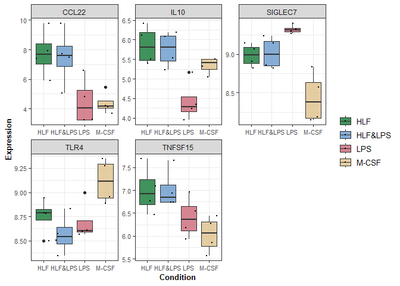<!-- -->

``` r
#Export as vector graphic - significances were added in the vector graphic program afterwards manually according to observations in the tests
graph2svg(Figure_4D, file = "Figure_4D", height = 3.2, width = 6.15)
```

    ## Exported graph as Figure_4D.svg

# Cell-Cell interaction model

## Preparation and retrieval of physical interaction DF (Figure 5A)

``` r
#Import physical protein-protein interactions (weekly updated and manually curated; approx. 25 000 innate and 300 000 immunology-relevant protein-protein interactions); available from GitHub repository

mydata <-read.delim("C:/Users/Michi/Documents/Microarray Analysis/data/protein protein interactions/all.mitab", header = TRUE, sep = "\t",
                    quote = "")

mydata$alt_identifier_A <- gsub("ensembl:", "", mydata$alt_identifier_A)
mydata$alt_identifier_B <- gsub("ensembl:", "", mydata$alt_identifier_B)
mydata$ncbi_taxid_A <- gsub("taxid:", "", mydata$ncbi_taxid_A)
mydata$ncbi_taxid_B <- gsub("taxid:", "", mydata$ncbi_taxid_B)
mydata_human <- mydata %>% filter(mydata$ncbi_taxid_A == "9606(Human)" & mydata$ncbi_taxid_B == "9606(Human)")
mydata_human_vector_A <- c(mydata_human$alt_identifier_A)


mydata_human$protein_A <- mapIds(org.Hs.eg.db,keys=mydata_human$alt_identifier_A, column="SYMBOL", keytype="ENSEMBL", multiVals="first")
```

    ## 'select()' returned 1:many mapping between keys and columns

``` r
mydata_human$protein_B <- mapIds(org.Hs.eg.db,keys=mydata_human$alt_identifier_B, column="SYMBOL", keytype="ENSEMBL", multiVals="first")
```

    ## 'select()' returned 1:many mapping between keys and columns

``` r
mydata_human$taxid <- c(9606)
mydata_human <- mydata_human %>% dplyr::select(alt_identifier_A, alt_identifier_B, interaction_type, protein_A, protein_B, taxid)

unique_combinations <- mydata_human[!duplicated(mydata_human[c('protein_A', 'protein_B')]),]
vector_proteins <- c(unique_combinations$protein_A, unique_combinations$protein_B)

d_2_symbol <- d_2 %>% dplyr::select(PROBEID, SYMBOL)
Comp_palmieri_Symbols <- Comp_palmieri %>% inner_join(d_2_symbol, by = "PROBEID")
protein_interactions <- subset(Comp_palmieri_Symbols, (Comp_palmieri_Symbols$SYMBOL %in% vector_proteins))
protein_interactions <- subset(protein_interactions, (protein_interactions$SYMBOL %in% membrane_protein_DB$SYMBOL))


#only diff expressed genes
DE_Symbols <- rbind(DE_comp1, DE_comp2)
DE_Symbols <- rbind(DE_Symbols, DE_comp3) %>% select(SYMBOL)
DE_Symbols <- DE_Symbols %>%  group_by(SYMBOL) %>% slice(1L) %>% ungroup() 
vector_DE_Symbols <- c(DE_Symbols$SYMBOL)
protein_interactions <- subset(protein_interactions, (protein_interactions$SYMBOL %in% vector_DE_Symbols))

protein_interactions_mean <- protein_interactions %>% group_by(PROBEID, Treatment) %>% mutate("mean" = mean(Expression), SD = sd(Expression)) %>% ungroup() %>% group_by(PROBEID, Treatment) %>% slice(1L) %>% ungroup()
protein_interactions_mean <- protein_interactions_mean %>% dplyr::select(-PROBEID, - Experiment, - Proband, - Expression, -SD)
protein_interactions_mean_mock <- protein_interactions_mean %>% filter(Treatment == "MOCK")
protein_interactions_mean_not_mock <- protein_interactions_mean %>% filter(Treatment != "MOCK")
protein_interactions_mean <- protein_interactions_mean_not_mock %>% merge(protein_interactions_mean_mock, by = "SYMBOL") 
protein_interactions_mean <- protein_interactions_mean %>% mutate(mean = mean.x - mean.y) %>% select(-mean.y, -mean.x, -Treatment.y) %>% rename(Treatment = Treatment.x)


protein_interactions_LPS <- protein_interactions_mean %>% filter(Treatment == "LPS")
protein_interactions_HLF <- protein_interactions_mean %>% filter(Treatment == "HLF")
protein_interactions_HLF_LPS <- protein_interactions_mean %>% filter(Treatment == "HLF_LPS")
protein_interactions_MOCK <- protein_interactions_mean %>% filter(Treatment == "MOCK")


#Import of the Monaco immune cell expression data 
immune_Proteins <- read.table(file = "C:/Users/Michi/Documents/Microarray Analysis/data/protein protein interactions/rna_immune_cell.tsv", sep = '\t', header = TRUE)

#select only entries for membrane proteins included in the physical protein-protein interaction dataset
immune_Proteins <- subset(immune_Proteins, (immune_Proteins$Gene.name %in% vector_proteins))
immune_Proteins <- subset(immune_Proteins, (immune_Proteins$Gene.name %in% membrane_protein_DB$SYMBOL))


immune_Proteins_nm <- immune_Proteins %>% filter(Immune.cell != "total PBMC") %>% rename("SYMBOL" = "Gene.name") %>% group_by(SYMBOL) %>% mutate(norm = nTPM) %>%  ungroup()
immune_Proteins_nm <- immune_Proteins_nm %>% na.omit()

protein_interactions_mean <- protein_interactions_mean %>% group_by(SYMBOL) %>%  mutate(norm = mean) %>% ungroup()
unique_combinations <- unique_combinations %>% filter(unique_combinations$protein_A != unique_combinations$protein_B) %>% select(protein_A, protein_B)

pacman::p_load("Tmisc")
unique_combinations <- unique_combinations %>% mutate(new_column = strSort(paste0(protein_A, protein_B, SEP = "")))
unique_combinations <- unique_combinations[!duplicated(unique_combinations$new_column), ] %>% select(-new_column)


#Select relevant columns and compute vectors of gene SYMBOLS
immune_Proteins <- immune_Proteins_nm %>% select(SYMBOL, Immune.cell, norm)
Protein_interactions <- protein_interactions_mean %>% select(SYMBOL, Treatment, norm) %>% data.frame()
vector_subsetted_proteins_other <- c(immune_Proteins$SYMBOL)
vector_subsetted_proteins_macrophages <- c(Protein_interactions$SYMBOL)


#Finalize  unique combinations of Protein Interactions
unique_combinations_2 <- unique_combinations %>% select(protein_B, protein_A)
colnames(unique_combinations_2) <- c("protein_A", "protein_B")

unique_combinations_both <- rbind(unique_combinations, unique_combinations_2)

#retrieve all interaction partners according to the physical protein-protein network of differentially expressed membrane proteins of our dataset and 
#membrane proteins denoted in the Monaco database
unique_combinations_subsetted <- subset(unique_combinations_both, (unique_combinations_both$protein_A %in% vector_subsetted_proteins_macrophages))
unique_combinations_subsetted <- subset(unique_combinations_subsetted, (unique_combinations_subsetted$protein_B %in% vector_subsetted_proteins_other))


#get all cell-types and target conditions

cell_types <- unique(immune_Proteins$Immune.cell)
macro_types <- unique(Protein_interactions$Treatment) 

looploop <- protein_interactions_mean %>% 
  select(SYMBOL, norm, Treatment) %>% 
  rename(protein_A = norm) 

#create an empty storage dataframe
storage_df <- data.frame(proteins = NA, product = NA, interaction= NA)

#create master-dataframe with expression values of our samples and the retrieved data for interaction calculation (physical membrane proteins)
for(i in cell_types){
  for(j in macro_types){
    
    loop_df <- unique_combinations_subsetted
    loop_macro_df <- subset(looploop, Treatment == j)
    
    loop_df$proteins <- paste0(loop_df$protein_A, "_", loop_df$protein_B)
    
    loop_df$protein_A <- loop_macro_df$protein_A[match(loop_df$protein_A, loop_macro_df$SYMBOL)]
    
    cell_df <- subset(immune_Proteins, Immune.cell == i)
    
    loop_df$protein_B <- cell_df$norm[match(loop_df$protein_B, cell_df$SYMBOL)]
    
    loop_df$product <- loop_df$protein_A*loop_df$protein_B
    
    loop_df$interaction <- paste0(j, "_", i)
    
    loop_df <- loop_df[,-c(1:2)]
    
    storage_df <- rbind(storage_df, loop_df)
    
  }
}

#retrieve dataframe
storage_df <- storage_df[-1, ]

#data wrangling
storage_df <- storage_df %>% mutate(Treatment = case_when(grepl("HLF_LPS", interaction) ~ "HLF_LPS", grepl("MOCK", interaction) ~"MOCK", grepl("HLF", interaction)~"HLF", grepl("LPS", interaction)~"LPS"))
storage_df <- storage_df %>% mutate(Interaction_partner = case_when(grepl("basophil", interaction) ~ "Basophil", grepl("classical monocyte", interaction) ~"classical monocyte", grepl("eosinophil", interaction)~"Eosinophil", grepl("gdT-cell", interaction)~"GdT-cell", grepl("intermediate monocyte", interaction) ~ "intermediate monocyte", grepl("MAIT T-cell", interaction) ~"MAIT T-cell", grepl("memory B-cell", interaction)~"Memory B-cell", grepl("memory CD4 T-cell", interaction)~"Memory CD4 T-cell", grepl("memory CD8 T-cell", interaction) ~"Memory CD8 T-cell", grepl("myeloid DC", interaction)~"Myeloid DC", grepl("naive B-cell", interaction)~"Naive B-cell", grepl("naive CD4 T-cell", interaction) ~ "Naive CD4 T-cell", grepl("naive CD8 T-cell", interaction) ~"Naive CD8 T-cell", grepl("neutrophil", interaction)~"neutrophil", grepl("NK-cell", interaction)~"NK-cell", grepl("non-classical monocyte", interaction) ~"Non-classical monocyte", grepl("plasmacytoid DC", interaction)~"Plasmacytoid DC", grepl("T-reg", interaction)~"T-reg"))
storage_df <- storage_df %>% filter(Interaction_partner != "classical monocyte" & Interaction_partner != "intermediate monocyte")

storage_df1 <- storage_df %>% group_by(interaction) %>% mutate(sum_Treatment_partner = sum(product)) %>% ungroup()

storage_df1 <- storage_df1 %>% group_by(Treatment, Interaction_partner) %>%
  slice(1L) %>% ungroup()
```

## Protein-Protein interaction radarchart (Figure 5A)

``` r
radar_df <- storage_df1  %>% select(Treatment, Interaction_partner, sum_Treatment_partner) %>% group_by(Treatment, Interaction_partner) %>% slice(1L) %>% ungroup() %>%  
  pivot_wider(names_from = "Interaction_partner", values_from = "sum_Treatment_partner") %>%
  column_to_rownames(var = "Treatment")

radar_df <- rbind(rep(60000,15) , rep(0,15) , radar_df)


coul <- c("#117733","#6699CC", "#CC6677")
colors_border <- coul
colors_in <- alpha(coul,0.18)
colors_in2 <- alpha(coul,0.78)

font_size <- 8
default_font_size <- par("cex")  # Get the default font size
scaling_factor <- font_size / default_font_size
par(cex = scaling_factor)

#gives error only in markdown
#Figure_5A <- radarchart(radar_df, axistype=1, pcol=colors_border , pfcol=colors_in, plwd=2.1, plty=1,
           #cglcol="grey", cglty=1, axislabcol="grey", caxislabels=c("", "", "", "", ""), cglwd=1,
           #vlcex=1.2, cex.axis = 1.5) 

#legend(x=0.95, y=1.2, legend = rownames(radar_df[-c(1,2),]), bty = "n", pch=20, col=colors_in2, text.col = "black", cex=1.2, pt.cex=3)

#par(cex = default_font_size)
#print(Figure_5A)

#Export as vector graphic
#graph2svg(file = "Figure_5A", height = 6.2, width = 4.6)
```

### Preparation of DF for analysis of proteins most relevant to differences in physical interaction between HLF+LPS and MOCK+LPS

``` r
interaction_df <- storage_df %>% filter(Treatment == "LPS" | Treatment == "HLF_LPS")
interaction_df_LPS <- interaction_df %>% filter(Treatment == "LPS")
interaction_df_HLF <- interaction_df %>% filter(Treatment == "HLF_LPS") %>% select(product) %>% rename(product_HLF = product)
interaction_df_2 <- interaction_df_LPS %>% bind_cols(interaction_df_HLF)
interaction_df_3 <- interaction_df_2 %>% mutate(difference = (abs(product)+abs(product_HLF)))
                                                

interaction_df_3 <- interaction_df_3 %>% arrange(desc(difference)) %>% group_by(Interaction_partner) %>%
  slice(1:10) %>% ungroup()

interaction_df <- subset(interaction_df, (interaction_df$product %in% interaction_df_3$product | interaction_df$product %in% interaction_df_3$product_HLF))

interaction_df_4 <-interaction_df %>% separate(proteins, c("macrophages", "interactor"))
interaction_df_5 <- interaction_df_4 %>% group_by(macrophages) %>% slice(1L) %>% ungroup() %>% rename("SYMBOL" = macrophages)
vector_interaction_5 <- c(interaction_df_5$SYMBOL)

#get norm. expression data again + compute means
d_2_symbol <- d_2 %>% dplyr::select(PROBEID, SYMBOL)
Comp_palmieri_Symbols <- Comp_palmieri %>% inner_join(d_2_symbol, by = "PROBEID")
protein_interactions <- subset(Comp_palmieri_Symbols, (Comp_palmieri_Symbols$SYMBOL %in% vector_proteins))
protein_interactions <- subset(protein_interactions, (protein_interactions$SYMBOL %in% membrane_protein_DB$SYMBOL))

#only diff expressed genes
DE_Symbols <- rbind(DE_comp1, DE_comp2)
DE_Symbols <- rbind(DE_Symbols, DE_comp3) %>% select(SYMBOL)
DE_Symbols <- DE_Symbols %>%  group_by(SYMBOL) %>% slice(1L) %>% ungroup() 
vector_DE_Symbols <- c(DE_Symbols$SYMBOL)
protein_interactions <- subset(protein_interactions, (protein_interactions$SYMBOL %in% vector_DE_Symbols))


protein_interactions_mean <- protein_interactions %>% group_by(PROBEID, Treatment) %>% mutate("mean" = mean(Expression), SD = sd(Expression)) %>% ungroup() %>% group_by(PROBEID, Treatment) %>% slice(1L) %>% ungroup()
protein_interactions_mean <- protein_interactions_mean %>% dplyr::select(-PROBEID, - Experiment, - Proband, - Expression, -SD)

#no raw expression is ready -> get vector interaction 4 subset

interaction_macrophages <- subset(protein_interactions_mean, (protein_interactions_mean$SYMBOL %in% vector_interaction_5)) %>% filter(Treatment == "LPS" | Treatment == "HLF_LPS")

interaction_df_4 <- interaction_df_4 %>% rename(SYMBOL = macrophages)
interaction_macrophages <- interaction_df_4 %>% merge(interaction_macrophages, by = "SYMBOL")
interaction_macrophages <- interaction_macrophages %>% select(SYMBOL, interactor, Interaction_partner, Treatment.y, mean)
interaction_macrophages <- interaction_macrophages[!duplicated(interaction_macrophages), ]

interaction_macrophages <- interaction_macrophages %>% filter(!(SYMBOL %in% c("EPS8", "VASP", "SOCS3", "PIK3AP1", "JAK3", "OAS3", "IFIT5", "LYN")))


Treatment_labs <- c("HLF&LPS", "LPS")
names(Treatment_labs) <- c("HLF_LPS", "LPS")
```

## Barchart of proteins most relevant to differences in physical interaction between HLF+LPS and MOCK+LPS (Figure 5C)

``` r
Figure_5C <- interaction_macrophages %>% mutate(value = 1,
                                   pair_cell = paste(interactor, Interaction_partner, sep = "_")) %>% 
  group_by(SYMBOL) %>% 
  mutate(count = length(unique(Interaction_partner))) %>%
  ungroup() %>% 
  select(SYMBOL, Treatment.y, mean, count) %>% 
  distinct() %>% 
  ggplot(aes(x = reorder(SYMBOL, -count), y = mean, fill = count)) + scale_fill_continuous(low = "#6699CC", high="#CC6677") +
  facet_grid(rows = "Treatment.y", labeller = labeller(Treatment.y = Treatment_labs))+
  geom_col() + labs(fill = "Interaction count", x = "Membrane protein", y = "Mean expression value") +
theme_bw() + theme(axis.text=element_text(size=8), axis.text.x = element_text(angle = 45, hjust =1.1 ), 
                                 axis.title = element_text(size = 10,  face = "bold"), 
                                 legend.title =element_text(size = 10),
                                 legend.text = element_text(size = 10))


#Export as vector graphic
print(Figure_5C)
```

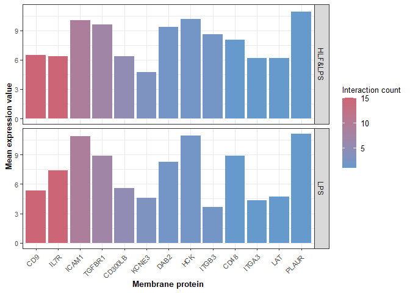<!-- -->

``` r
graph2svg(Figure_5C, file = "Figure_5b", height = 4, width = 4.5)
```

    ## Exported graph as Figure_5b.svg

## Preparation and retrieval of soluble interaction DF (Figure 5B)

``` r
#Get dataframe and vectors of unique soluble cytokine-receptor interactions and annotate them with Gene Symbols
pacman::p_load(KEGGgraph)
Cytokine_interactions <- KEGGgraph::parseKGML2DataFrame("C:/Users/Michi/Documents/Microarray Analysis/data/Cytokine data KeGG.xml", reactions=FALSE)

Cytokine_interactions$from <- translateKEGGID2GeneID(Cytokine_interactions$from)
Cytokine_interactions$to <- translateKEGGID2GeneID(Cytokine_interactions$to)


Cytokine_interactions$from <- mapIds(org.Hs.eg.db, Cytokine_interactions$from, 'SYMBOL', 'ENTREZID')
```

    ## 'select()' returned 1:1 mapping between keys and columns

``` r
Cytokine_interactions$to <- mapIds(org.Hs.eg.db, Cytokine_interactions$to, 'SYMBOL', 'ENTREZID')
```

    ## 'select()' returned 1:1 mapping between keys and columns

``` r
Cytokine_interactions <- Cytokine_interactions %>% select(from, to)

Cytokine_interactions <- Cytokine_interactions %>% rename("cytokine" = "from")
Cytokine_interactions <- Cytokine_interactions %>% rename("receptor" = "to")

Cytokine_interactions_unique <- Cytokine_interactions[!duplicated(Cytokine_interactions[c('receptor', 'cytokine')]),]
vector_cytokine_interaction <- c(Cytokine_interactions_unique$cytokine) %>% unique()
vector_cytokine_receptor_interaction <- c(Cytokine_interactions_unique$receptor) %>% unique()

d_2_symbol <- d_2 %>% dplyr::select(PROBEID, SYMBOL)
Comp_palmieri_Symbols <- Comp_palmieri %>% inner_join(d_2_symbol, by = "PROBEID")
cytokine_interactions <- subset(Comp_palmieri_Symbols, (Comp_palmieri_Symbols$SYMBOL %in% vector_cytokine_interaction))
cytokine_interactions <- subset(cytokine_interactions, (cytokine_interactions$SYMBOL %in% cytokine_DB_vector))


#only diff expressed genes
DE_Symbols <- rbind(DE_comp1, DE_comp2)
DE_Symbols <- rbind(DE_Symbols, DE_comp3) %>% select(SYMBOL)
DE_Symbols <- DE_Symbols %>%  group_by(SYMBOL) %>% slice(1L) %>% ungroup() 
vector_DE_Symbols <- c(DE_Symbols$SYMBOL)
cytokine_interactions <- subset(cytokine_interactions, (cytokine_interactions$SYMBOL %in% vector_DE_Symbols))

cytokine_interactions_mean <- cytokine_interactions %>% group_by(PROBEID, Treatment) %>% mutate("mean" = mean(Expression), SD = sd(Expression)) %>% ungroup() %>% group_by(PROBEID, Treatment) %>% slice(1L) %>% ungroup()
cytokine_interactions_mean <- cytokine_interactions_mean %>% dplyr::select(-PROBEID, - Experiment, - Proband, - Expression, -SD)
cytokine_interactions_mean_mock <- cytokine_interactions_mean %>% filter(Treatment == "MOCK")
cytokine_interactions_mean_not_mock <- cytokine_interactions_mean %>% filter(Treatment != "MOCK")
cytokine_interactions_mean <- cytokine_interactions_mean_not_mock %>% merge(cytokine_interactions_mean_mock, by = "SYMBOL") 
cytokine_interactions_mean <-cytokine_interactions_mean %>% mutate(mean = mean.x - mean.y) %>% select(-mean.y, -mean.x, -Treatment.y) %>% rename(Treatment = Treatment.x)


cytokine_interactions_LPS <- cytokine_interactions_mean %>% filter(Treatment == "LPS")
cytokine_interactions_HLF <- cytokine_interactions_mean %>% filter(Treatment == "HLF")
cytokine_interactions_HLF_LPS <- cytokine_interactions_mean %>% filter(Treatment == "HLF_LPS")
cytokine_interactions_MOCK <- cytokine_interactions_mean %>% filter(Treatment == "MOCK")


#Import of the Monaco immune cell expression data 
immune_Proteins <- read.table(file = "C:/Users/Michi/Documents/Microarray Analysis/data/protein protein interactions/rna_immune_cell.tsv", sep = '\t', header = TRUE)

#select only entries included the cytokine-receptor interaction data and Immports list of annotated cytokines
Cytokine_receptors <- subset(immune_Proteins, (immune_Proteins$Gene.name %in% vector_cytokine_receptor_interaction))
Cytokine_receptors <- subset(Cytokine_receptors, (Cytokine_receptors$Gene.name %in% cytokine_DB_vector))

Cytokine_receptors_nm <- Cytokine_receptors %>% filter(Immune.cell != "total PBMC") %>% rename("SYMBOL" = "Gene.name") %>% group_by(SYMBOL) %>% mutate(norm = nTPM) %>%  ungroup()
Cytokine_receptors_nm <- Cytokine_receptors_nm %>% na.omit()


#wrangling inbetween
cytokine_interactions_mean <- cytokine_interactions_mean %>% group_by(SYMBOL) %>%  mutate(norm = mean) %>% ungroup()
Cytokine_interactions_unique <- Cytokine_interactions_unique %>% filter(Cytokine_interactions_unique$cytokine != Cytokine_interactions_unique$receptor) %>% select(cytokine, receptor)


##Select relevant columns and compute vectors of gene SYMBOLS
Cytokine_receptors <- Cytokine_receptors_nm %>% select(SYMBOL, Immune.cell, norm)
Cytokine_interactions <- cytokine_interactions_mean %>% select(SYMBOL, Treatment, norm) %>% data.frame()
vector_subsetted_receptors_other <- c(Cytokine_receptors$SYMBOL)
vector_subsetted_cytokines_macrophages <- c(Cytokine_interactions$SYMBOL)

#retrieve all interaction partners according to the soluble interaction-network of differentially expressed cytokines in our dataset and 
#cytokine receptors denoted in the Monaco database
Cytokine_interactions_unique_subsetted <- subset(Cytokine_interactions_unique, (Cytokine_interactions_unique$cytokine %in% vector_subsetted_cytokines_macrophages))
Cytokine_interactions_unique_subsetted <- subset(Cytokine_interactions_unique_subsetted, (Cytokine_interactions_unique_subsetted$receptor %in% vector_subsetted_receptors_other))


#get all cell-types and target conditions 
cell_types <- unique(Cytokine_receptors$Immune.cell)
macro_types <- unique(Cytokine_interactions$Treatment) 

looploop <- cytokine_interactions_mean %>% 
  select(SYMBOL, norm, Treatment) %>% 
  rename(cytokine = norm)

#create an empty storage dataframe
storage_df <- data.frame(proteins = NA, product = NA, interaction= NA)

#create master-dataframe with expression values of our samples and the retrieved data for interaction calculation (soluble cytokine interactions)
for(i in cell_types){
  for(j in macro_types){
    
    loop_df <- Cytokine_interactions_unique_subsetted
    loop_macro_df <- subset(looploop, Treatment == j)
    
    loop_df$proteins <- paste0(loop_df$cytokine, "_", loop_df$receptor)
    
    loop_df$cytokine <- loop_macro_df$cytokine[match(loop_df$cytokine, loop_macro_df$SYMBOL)]
    
    cell_df <- subset(Cytokine_receptors, Immune.cell == i)
    
    loop_df$receptor <- cell_df$norm[match(loop_df$receptor, cell_df$SYMBOL)]
    
    loop_df$product <- loop_df$cytokine*loop_df$receptor
    
    loop_df$interaction <- paste0(j, "_", i)
    
    loop_df <- loop_df[,-c(1:2)]
    
    storage_df <- rbind(storage_df, loop_df)
    
  }
}


#retrieve dataframe
storage_df <- storage_df[-1, ]

#data wrangling
storage_df <- storage_df %>% mutate(Treatment = case_when(grepl("HLF_LPS", interaction) ~ "HLF_LPS", grepl("MOCK", interaction) ~"MOCK", grepl("HLF", interaction)~"HLF", grepl("LPS", interaction)~"LPS"))
storage_df <- storage_df %>% mutate(Interaction_partner = case_when(grepl("basophil", interaction) ~ "Basophil", grepl("classical monocyte", interaction) ~"classical monocyte", grepl("eosinophil", interaction)~"Eosinophil", grepl("gdT-cell", interaction)~"GdT-cell", grepl("intermediate monocyte", interaction) ~ "intermediate monocyte", grepl("MAIT T-cell", interaction) ~"MAIT T-cell", grepl("memory B-cell", interaction)~"Memory B-cell", grepl("memory CD4 T-cell", interaction)~"Memory CD4 T-cell", grepl("memory CD8 T-cell", interaction) ~"Memory CD8 T-cell", grepl("myeloid DC", interaction)~"Myeloid DC", grepl("naive B-cell", interaction)~"Naive B-cell", grepl("naive CD4 T-cell", interaction) ~ "Naive CD4 T-cell", grepl("naive CD8 T-cell", interaction) ~"Naive CD8 T-cell", grepl("neutrophil", interaction)~"neutrophil", grepl("NK-cell", interaction)~"NK-cell", grepl("non-classical monocyte", interaction) ~"Non-classical monocyte", grepl("plasmacytoid DC", interaction)~"Plasmacytoid DC", grepl("T-reg", interaction)~"T-reg"))
storage_df <- storage_df %>% filter(Interaction_partner != "classical monocyte" & Interaction_partner != "intermediate monocyte")

storage_df1 <- storage_df %>% group_by(interaction) %>% mutate(sum_Treatment_partner = sum(product)) %>% ungroup()

storage_df1 <- storage_df1 %>% group_by(Treatment, Interaction_partner) %>%
  slice(1L) %>% ungroup()
```

## Soluble interactions radarchart (Figure 5B)

``` r
radar_df <- storage_df1  %>% select(Treatment, Interaction_partner, sum_Treatment_partner) %>% group_by(Treatment, Interaction_partner) %>% slice(1L) %>% ungroup() %>%  
  pivot_wider(names_from = "Interaction_partner", values_from = "sum_Treatment_partner") %>%
  column_to_rownames(var = "Treatment")

radar_df <- rbind(rep(75000,15) , rep(0,15) , radar_df)

library(RColorBrewer)
coul <- c("#117733","#6699CC", "#CC6677")
colors_border <- coul
library(scales)
colors_in <- alpha(coul,0.18)
colors_in2 <- alpha(coul,0.78)

font_size <- 8
default_font_size <- par("cex")  # Get the default font size
scaling_factor <- font_size / default_font_size
par(cex = scaling_factor)

#gives error only in markdown
#Figure_5B <- radarchart(radar_df, axistype=1, pcol=colors_border , pfcol=colors_in, plwd=2.1, plty=1,
                       #cglcol="grey", cglty=1, axislabcol="grey", caxislabels=c("", "", "", "", ""), cglwd=1,
                       #vlcex=1.2 
#) 
#legend(x=0.95, y=1.2, legend = rownames(radar_df[-c(1,2),]), bty = "n", pch=20, col=colors_in2, text.col = "black", cex=1.2, pt.cex=3)

#par(cex = default_font_size)

#print(Figure_5B)

#Export as vector graphic
#graph2svg(Figure_5B, file = "Figure_5B", height = 6.2, width = 4.6)
```

### Preparation of DF for analysis of proteins most relevant to differences in soluble interaction between HLF+LPS and MOCK+LPS

``` r
interaction_df <- storage_df %>% filter(Treatment == "LPS" | Treatment == "HLF_LPS")
interaction_df_LPS <- interaction_df %>% filter(Treatment == "LPS")
interaction_df_HLF <- interaction_df %>% filter(Treatment == "HLF_LPS") %>% select(product) %>% rename(product_HLF = product)
interaction_df_2 <- interaction_df_LPS %>% bind_cols(interaction_df_HLF)
interaction_df_3 <- interaction_df_2 %>% mutate(difference = (abs(product)+abs(product_HLF)))

interaction_df_3 <- interaction_df_3 %>% arrange(desc(difference)) %>% group_by(Interaction_partner) %>%
  slice(1:10) %>% ungroup()

interaction_df <- subset(interaction_df, (interaction_df$product %in% interaction_df_3$product | interaction_df$product %in% interaction_df_3$product_HLF))

interaction_df_4 <-interaction_df %>% separate(proteins, c("macrophages", "interactor"))
interaction_df_5 <- interaction_df_4 %>% group_by(macrophages) %>% slice(1L) %>% ungroup() %>% rename("SYMBOL" = macrophages)
vector_interaction_5 <- c(interaction_df_5$SYMBOL)

#get norm. expression data again + compute means
d_2_symbol <- d_2 %>% dplyr::select(PROBEID, SYMBOL)
Comp_palmieri_Symbols <- Comp_palmieri %>% inner_join(d_2_symbol, by = "PROBEID")
cytokine_interactions <- subset(Comp_palmieri_Symbols, (Comp_palmieri_Symbols$SYMBOL %in% vector_cytokine_interaction))
cytokine_interactions <- subset(cytokine_interactions, (cytokine_interactions$SYMBOL %in% cytokine_DB_vector))


#only diff expressed genes
DE_Symbols <- rbind(DE_comp1, DE_comp2)
DE_Symbols <- rbind(DE_Symbols, DE_comp3) %>% select(SYMBOL)
DE_Symbols <- DE_Symbols %>%  group_by(SYMBOL) %>% slice(1L) %>% ungroup() 
vector_DE_Symbols <- c(DE_Symbols$SYMBOL)
cytokine_interactions <- subset(cytokine_interactions, (cytokine_interactions$SYMBOL %in% vector_DE_Symbols))


cytokine_interactions_mean <- cytokine_interactions %>% group_by(PROBEID, Treatment) %>% mutate("mean" = mean(Expression), SD = sd(Expression)) %>% ungroup() %>% group_by(PROBEID, Treatment) %>% slice(1L) %>% ungroup()
cytokine_interactions_mean <- cytokine_interactions_mean %>% dplyr::select(-PROBEID, - Experiment, - Proband, - Expression, -SD)

#no raw expression is ready -> get vector interaction 4 subset

interaction_macrophages <- subset(cytokine_interactions_mean, (cytokine_interactions_mean$SYMBOL %in% vector_interaction_5)) %>% filter(Treatment == "LPS" | Treatment == "HLF_LPS")

interaction_df_4 <- interaction_df_4 %>% rename(SYMBOL = macrophages)
interaction_macrophages <- interaction_df_4 %>% merge(interaction_macrophages, by = "SYMBOL")
interaction_macrophages <- interaction_macrophages %>% select(SYMBOL, interactor, Interaction_partner, Treatment.y, mean)
interaction_macrophages <- interaction_macrophages[!duplicated(interaction_macrophages), ]

interaction_macrophages <- interaction_macrophages %>% filter(!(SYMBOL %in% c("IL21R", "IL7R", "CSF2RB", "IL12RB2", 
                                                                              "TNFRSF10D", "IL1R1", "TGFBR1", "IL6R", 
                                                                              "CSF3R", "CD40", "TNFRSF4", "IFNGR2", "TNFRSF9", 
                                                                              "IFNAR1", "TNFRSF18")))
```

## Barchart of proteins most relevant to differences in soluble interaction between HLF+LPS and MOCK+LPS (Figure 5D)

``` r
Figure_5D<- interaction_macrophages %>% mutate(value = 1,
                                                pair_cell = paste(interactor, Interaction_partner, sep = "_")) %>% 
  group_by(SYMBOL) %>% 
  mutate(count = length(unique(Interaction_partner))) %>%
  ungroup() %>% 
  select(SYMBOL, Treatment.y, mean, count) %>% 
  distinct() %>% 
  ggplot(aes(x = reorder(SYMBOL, -count), y = mean, fill = count)) + scale_fill_continuous(low = "#6699CC", high="#CC6677") +
  facet_grid(rows = "Treatment.y", labeller = labeller(Treatment.y = Treatment_labs))+
  geom_col() + labs(fill = "Interaction count", x = "Cytokine", y = "Mean expression value") + theme_bw() + theme(axis.text=element_text(size=8), axis.text.x = element_text(angle = 45, hjust =1.1 ),
                                  axis.title = element_text(size = 10,  face = "bold"), 
                                  legend.title =element_text(size = 10),
                                  legend.text = element_text(size = 10))

print(Figure_5D)
```

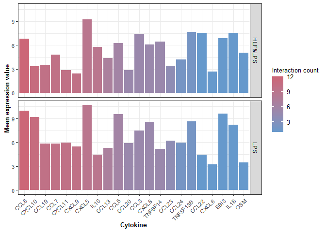<!-- -->

``` r
#Export as vector graphic
graph2svg(Figure_5D, file = "Figure_5D", height = 4.5, width = 5)
```

    ## Exported graph as Figure_5D.svg
